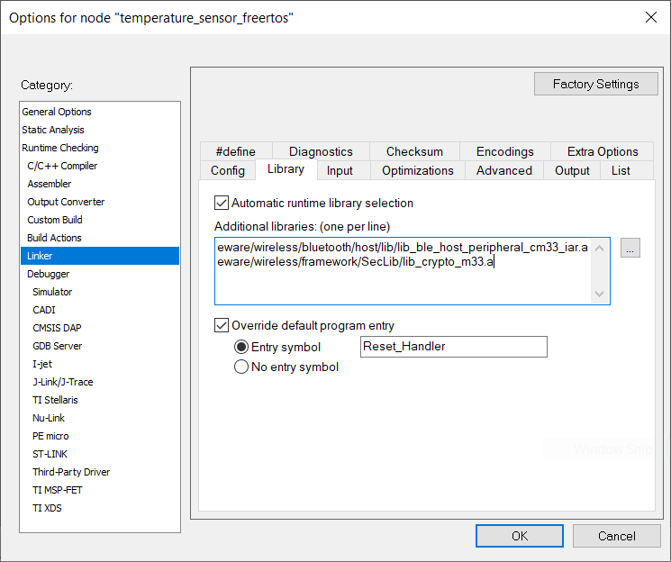

# Bluetooth Low Energy Host Stack configuration

The Bluetooth LE Host Stack libraries are found in the `middleware/wireless/bluetooth/host/lib` folder. The user should add the best matching library for its use case to the linker options of its project.

For example, the temperature sensor uses the Peripheral Host Stack library, as shown in [Figure 1](#FIG_U52_W5F_CY):

**Parent topic:**[Application Structure](../topics/application_structure.md)

