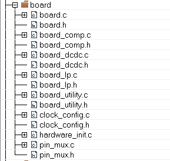

# Board configuration

The configuration files for the supported boards can be found in the *board* folder, as shown in [Figure 1](#FIG_CHS_HSF_CY). The files contain clock and pin configurations that are used by the drivers. The user can customize the board files by modifying the configuration of the pins and clock source according to his design.    
**Figure 13: Board configuration files**   
   

**Parent topic:**[Application Structure](../topics/application_structure.md)

