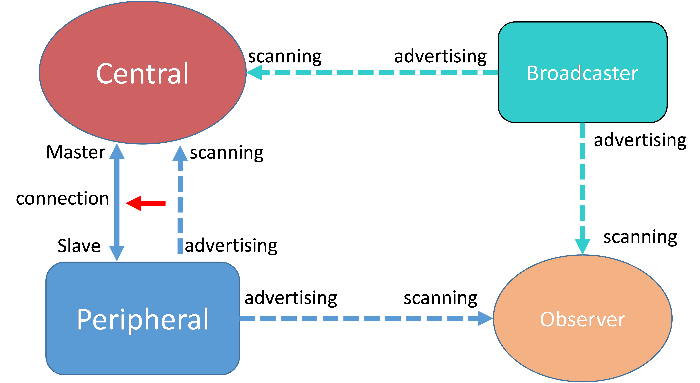

# Generic Access Profile \(GAP\) Layer

The GAP layer manages connections, security, and bonded devices.

The GAP layer APIs are built on top of the Host-Controller Interface \(HCI\), the Security Manager Protocol \(SMP\), and the Device database.

GAP defines four possible roles that a Bluetooth Low Energy device may have in a Bluetooth Low Energy system:

-   **Central**
    -   Scans for advertisers \(Peripherals and Broadcasters\)
    -   Initiates connection to Peripherals; Central at Link Layer \(LL\) level
    -   Usually acts as a GATT Client, but can also contain a GATT Database itself
-   **Peripheral**
    -   Advertises and accepts connection requests from Central devices; LL Peripheral
    -   Usually contains a GATT Database and acts as a GATT Server, but may also be a Client
-   **Observer**
    -   Scans for advertisers, but does not initiate connections; Transmit is optional
-   **Broadcaster**
    -   Advertises, but does not accept connection requests from Central devices; Receive is optional



[Figure 1](#FIG_EF5_SB5_1Y) illustrates the generic GAP topology.


```{include} ../topics/peripheral_setup_002.md
:heading-offset: 1
```

```{include} ../topics/central_setup_001.md
:heading-offset: 1
```

```{include} ../topics/le_data_packet_length_extension.md
:heading-offset: 1
```

```{include} ../topics/privacy_feature.md
:heading-offset: 1
```

```{include} ../topics/setting_phy_mode_in_a_connection.md
:heading-offset: 1
```

```{include} ../topics/data_management_of_bonded_devices.md
:heading-offset: 1
```

```{include} ../topics/controller_enhanced_notifications.md
:heading-offset: 1
```

```{include} ../topics/extended_advertising.md
:heading-offset: 1
```

```{include} ../topics/periodic_advertising.md
:heading-offset: 1
```

```{include} ../topics/periodic_advertizing_with_responses.md
:heading-offset: 1
```

```{include} ../topics/encrypted_advertising_data_0.md
:heading-offset: 1
```

```{include} ../topics/L2CAP%20Credit-Based%20Channels.md
:heading-offset: 1
```

```{include} ../topics/enhanced_att.md
:heading-offset: 1
```

