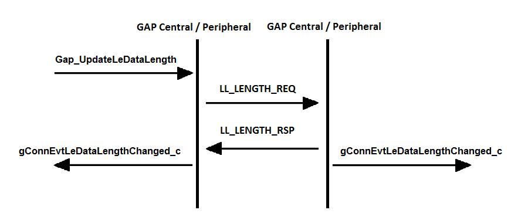

# LE data packet length extension

This new feature extends the maximum data channel payload length from 27 to 251 octets.

The length management is done automatically by the link layer immediately after the connection is established. The stack passes the default values for maximum transmission number of payload octets and maximum packet transmission time that the application configures at compilation time in *ble\_config.h*:

```

#ifndef gBleDefaultTxOctets_c
#define gBleDefaultTxOctets_c        0x00FB
#endif

#ifndef gBleDefaultTxTime_c
#define gBleDefaultTxTime_c          0x0848
#endif
```

The device can update the data length anytime, while in connection. The function that triggers this mechanism is the following:

```
bleResult_t Gap_UpdateLeDataLength
(
    deviceId_t         deviceId,
    uint16_t    txOctets,
    uint16_t    txTime
);
```

After the procedure executes, a *gConnEvtLeDataLengthChanged\_c* connection event is triggered with the maximum values for number of payload octets and time to transmit and receive a link layer data channel PDU. The event is send event if the remote device initiates the procedure. This procedure is shown in [Figure 5](#FIG_Z2L_PKB_BY).<br>
**Figure 5. Data Length Update Procedure** 


**Parent topic:**[Generic Access Profile \(GAP\) Layer](../topics/generic_access_profile_gap_layer.md)

