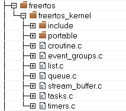

# Operating system selection

The SDK offers different projects for each supported operating system \(FreeRTOS OS\) and for BareMetal configuration. To switch between systems, the user needs to switch the workspace.

The RTOS source code is found in the SDK package and is linked in the workspace in the *freertos* virtual folder, as shown in [Figure 1](#FIG_UDL_MRF_CY):

**Parent topic:**[RTOS specifics](../topics/rtos_specifics.md)

