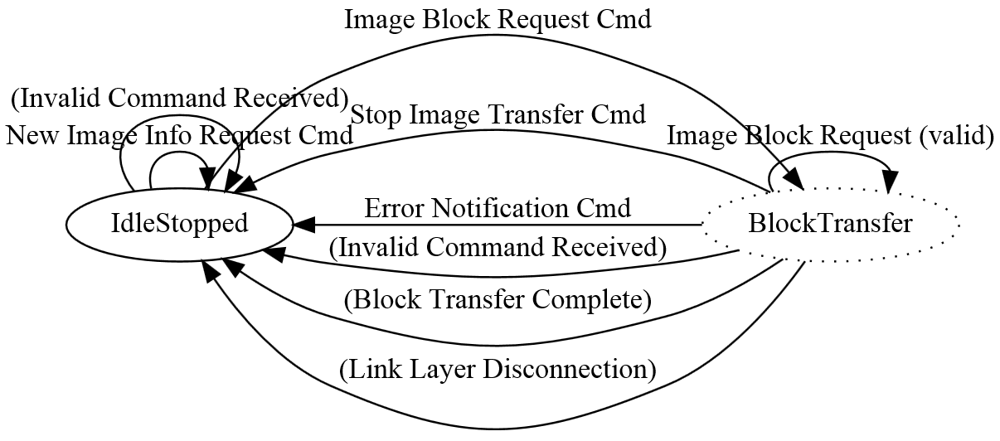

# OTAP server

Before any OTAP transactions can be done the application which acts as an OTAP Server must connect to a peer device and perform ATT service and characteristic discovery. Once the handles of the OTAP Service, OTAP Control Point and OTAP Data characteristics and their descriptors are found then OTAP communication can begin.

A good starting point for OTAP transactions for both the OTAP Server and The OTAP client is the moment the Server writes the OTAP Control Point CCCD to receive ATT Indications from the OTAP Client. At that point the Server can send a New Image Notification to the Client if it finds out what kind of device the client is through other means than the OTAP server. How this can be done is entirely application-specific. If the OTAP Server does not know exactly what kind of device is the OTAP Client it can wait for the Client to send a New Image Info Request. Again, the best behavior depends on application requirements.

Once OTAP communication begins then the OTAP Server just has to wait for commands from the OTAP Client and answer them. This behavior is almost completely stateless. An example state diagram for the OTAP Server application is shown in [Figure 1](#FIG_LZD_DZM_CY).



The OTAP Server waits in an idle state until a valid Image Block Request command is received and then moves to a pseudo-state and starts sending the requested block. The transfer can be interrupted by some commands \(Error Notification, Stop Image Transfer, and so on\) or other events \(disconnection, user interruption, and so on\).

The *otap\_interface.h* file contains infrastructure for sending and receiving OTAP Commands and parsing OTAP image files. Packed structure types are defined for all OTAP commands and type enumerations are defined for command parameter values and some configuration values like the data payloads for the different transfer methods.

To receive ATT Indications and ATT Write Confirmations from the OTAP Client the OTAP Server application registers a set of callbacks in the stack. This is done in the *BluetoothLEHost\_Initialized* function.

```
App_RegisterGattClientProcedureCallback (BleApp_GattClientCallback);
App_RegisterGattClientIndicationCallback (BleApp_GattIndicationCallback);
```

This *BleApp\_GattIndicationCallback\(\)* function is called when any attribute is indicated so the handle of the indicated attribute must be checked against a list of expected handles. In our case, we are looking for the OTAP Control Point handle that was obtained during the discovery procedure.

The *BleApp\_GattIndicationCallback\(\)* function from the demo calls an application-specific function called *BleApp\_AttributeIndicated\(\)* in which the OTAP Commands are handled.

```
static void BleApp_AttributeIndicated
(
    deviceId_t     deviceId,
    uint16_t       handle,
    uint8_t*       pValue,
    uint16_t       length
)
{
    if (handle == mPeerInformation.customInfo.otapServerConfig.hControlPoint)
    {
       otapCommandVars.pValueTemp = pValue;
        otapCommand_t*  pOtaCmd = otapCommandVars.otapCommandTemp;
        /* ... Missing code here ... */
        /* If the OTAP Server does not have internal storage then all commands must be forwarded
          *  via the serial interface. */
            FsciBleOtap_SendPkt (&(pOtaCmd->cmdId),
                        (uint8_t*)(&(pOtaCmd->cmd)),
                        length - gOtap_CmdIdFieldSize_c);
    }
    elseif (handle == otherHandle)
    {
        /* Handle other attribute indications here */
        /* ... Missing code here ... */
    }
    else
    {
        /*! A GATT Client is trying to GATT Indicate an unknown attribute value.
         * This should not happen. Disconnect the link. */
        Gap_Disconnect (deviceId);
    }
}
```

OTAP Server demo does not have internal storage, so all commands are forwarded via the serial interface.

To send OTAP Commands to the OTAP Client the application running the OTAP Server calls the *OtapServer\_SendCommandToOtapClient\(\)* function, which performs an ATT Write operation on the OTAP Control Point attribute.

```
static void OtapServer_SendCommandToOtapClient 
        (deviceId_t  otapClientDevId,
         void*       pCommand,
         uint16_t    cmdLength)
{
    /* GATT Characteristic to be written - OTAP Client Control Point */
    gattCharacteristic_t    otapCtrlPointChar;
    bleResult_t             bleResult;

    /* Only the value handle element of this structure is relevant for this operation. */
    otapCtrlPointChar.value.handle = mPeerInformation.customInfo.otapServerConfig.hControlPoint;
    otapCtrlPointChar.value.valueLength = 0;
    otapCtrlPointChar.cNumDescriptors = 0;
    otapCtrlPointChar.aDescriptors = NULL;

    bleResult = GattClient_SimpleCharacteristicWrite (mPeerInformation.deviceId,
                                                      &otapCtrlPointChar,
                                                      cmdLength,
                                                      pCommand);

    if (gBleSuccess_c == bleResult)
    {
        otapServerData.lastCmdSentToOtapClient = (otapCmdIdt_t)(((otapCommand_t*)pCommand)->cmdId);
    }
    else
    {
        /*! A Bluetooth Low Energy error has occurred - Disconnect */
        (void)Gap_Disconnect (otapClientDevId);
    }
}
   
```

The ATT Confirmation for the ATT Write is received in the *BleApp\_GattClientCallback\(\)* set up earlier which receives a GATT procedure success message for a *gGattProcWriteCharacteristicValue\_c* procedure type.

```
static void BleApp_GattClientCallback(
    deviceId_t              serverDeviceId,
    gattProcedureType_t     procedureType,
    gattProcedureResult_t   procedureResult,
    bleResult_t             error
)
{
   union
    {
        uint8_t                     errorTemp;
        attErrorCode_t              attErrorCodeTemp;
    }attErrorCodeVars;

    if (procedureResult == gGattProcError_c)
    {
        attErrorCodeVars.errorTemp = (uint8_t)error & 0xFFU;
        attErrorCode_t attError = attErrorCodeVars.attErrorCodeTemp;
        if (attError == gAttErrCodeInsufficientEncryption_c     ||
            attError == gAttErrCodeInsufficientAuthorization_c  ||
            attError == gAttErrCodeInsufficientAuthentication_c)
        {
    #if gAppUsePairing_d
            /* Start Pairing Procedure */
            (void)Gap_Pair (serverDeviceId, &gPairingParameters);
    #endif
        }

        BleApp_StateMachineHandler (serverDeviceId, mAppEvt_GattProcError_c);
    }
    else if (procedureResult == gGattProcSuccess_c)
    {
        switch(procedureType)
        {
            /* ... Missing code here... */
            case gGattProcWriteCharacteristicValue_c:
            {
                BleApp_HandleValueWriteConfirmations (serverDeviceId);
            }
            break;

            default:
                ; /* For MISRA compliance */
           break;
        }

        BleApp_StateMachineHandler(serverDeviceId, mAppEvt_GattProcComplete_c);
    }
    else
    {
        ; /* For MISRA compliance */
    }
}
```

The *BleApp\_HandleValueWriteConfirmations\(\)* function deals with ATT Write Confirmations based on the requirements of the application.

There are two possible transfer methods for Image Chunks, the ATT transfer method and the L2CAP transfer method. The OTAP server is prepared to handle both, as requested by the OTAP Client.

To be able to use the L2CAP transfer method, the OTAP Server application must register a L2CAP LE PSM and 2 callbacks: a data callback and a control callback. This is done by using the *BluetoothLEHost\_Initialized\(\)* function.

```
/* Register OTAP L2CAP PSM */
  L2ca_RegisterLePsm (gOtap_L2capLePsm_c,
                      gOtapCmdImageChunkCocLength_c); /*!< The negotiated MTU must be higher than the biggest data chunk that is sent fragmented */
...
  App_RegisterLeCbCallbacks(BleApp_L2capPsmDataCallback, BleApp_L2capPsmControlCallback);
```

The data callback *BleApp\_L2capPsmDataCallback\(\)* is not used by the OTAP Server.

The control callback is used to handle L2CAP LE PSM connection requests from the OTAP Client and other events: PSM disconnections, No peer credits, and so on. The OTAP Client must initiate the L2CAP PSM connection if it wants to use the L2CAP transfer method.

```
static void BleApp_L2capPsmControlCallback(l2capControlMessageType_t messageType,
                                                                          void              pMessage)
{
    switch (messageType)
    {
        case gL2ca_LePsmConnectRequest_c:
        {
            l2caLeCbConnectionRequest_t *pConnReq = ( l2caLeCbConnectionRequest_t *)pMessage;
            /* Respond to the peer L2CAP CB Connection request - send a connection response. */
            L2ca_ConnectLePsm (gOtap_L2capLePsm_c,
                               pConnReq-> deviceId,
                               mAppLeCbInitialCredits_c);
            break;
        }
        case gL2ca_LePsmConnectionComplete_c:
        {
            l2caLeCbConnectionComplete_t *pConnComplete = ( l2caLeCbConnectionComplete_t *)pMessage;
            if (pConnComplete->result == *gSuccessful_c)
            {
                /* Set the application L2CAP PSM Connection flag to TRUE because there is no gL2ca_LePsmConnectionComplete_c
                 * event on the responder of the PSM connection. */
                otapServerData. l2capPsmConnected = TRUE;
                otapServerData. l2capPsmChannelId = pConnComplete->cId;
            }
            break;
        }
        case gL2ca_LePsmDisconnectNotification_c:
        {
            l2caLeCbDisconnection_t *pCbDisconnect = ( l2caLeCbDisconnection_t *)pMessage;
            /* Call App State Machine */
            BleApp_StateMachineHandler (pCbDisconnect-> deviceId, mAppEv_CbDisconnected_c);
            otapServerData. l2capPsmConnected = FALSE;
            break;
        }
        case gL2ca_NoPeerCredits_c:
        {
            l2caLeCbNoPeerCredits_t *pCbNoPeerCredits = ( l2caLeCbNoPeerCredits_t *)pMessage;
            L2ca_SendLeCredit (pCbNoPeerCredits-> deviceId,
                               otapServerData. l2capPsmChannelId,
                               mAppLeCbInitialCredits_c);
            break;
        }
        case gL2ca_LocalCreditsNotification_c*:
        {
            l2caLeCbLocalCreditsNotification_t *pMsg = ( l2caLeCbLocalCreditsNotification_t *)pMessage;
            **break**;
        }
        default:
            break;
    }
}
```

The ATT transfer method is supported by default but the L2CAP transfer method only works if the OTAP Client opens an L2CAP PSM credit-oriented channel.

To send data chunks to the OTAP Client the OTAP Server application calls the *OtapServer\_SendCImgChunkToOtapClient\(\)* function which delivers the chunk via the selected transfer method. For the ATT transfer method the chunk is sent via the *GattClient\_CharacteristicWriteWithoutResponse\(\)* function and for the L2CAP transfer method the chunk is sent via the *L2ca\_SendLeCbData\(\)* function.

```
static void OtapServer\_SendCImgChunkToOtapClient (deviceId_t otapClientDevId,
                                                 void      pChunk,
                                                 uint16_t   chunkCmdLength)
{
    bleResult_t bleResult = gBleSuccess_c;
    if (otapServerData.transferMethod == gOtapTransferMethodAtt_c)
    {
        /* GATT Characteristic to be written without response - OTAP Client Data */
        gattCharacteristic_t otapDataChar;
        /* Only the value handle element of this structure is relevant for this operation. */
        otapDataChar.value.handle = mPeerInformation.customInfo.otapServerConfig.hData;
        bleResult = GattClient_CharacteristicWriteWithoutResponse
                                                (mPeerInformation.deviceId,
                                                 &otapDataChar,
                                                 chunkCmdLength,
                                                 pChunk);
    }
    else if (otapServerData.transferMethod == gOtapTransferMethodL2capCoC_c)
    {
        bleResult = L2ca_SendLeCbData (mPeerInformation.deviceId,
                                       otapServerData.l2capPsmChannelId,
                                       pChunk,
                                       chunkCmdLength);
    }
    if (gBleSuccess_c != bleResult)
    {
        /*! A Bluetooth Low Energy error has occurred - Disconnect */
        Gap_Disconnect (otapClientDevId);
    }
}
```

The OTAP Server demo application relays all commands received from the OTAP Client to a PC through the FSCI type protocol running over a serial interface. It also directly relays all responses from the PC back to the OTAP Client.

Other implementations can bring the image to an external memory through other means of communication and directly respond to the OTAP Client requests.

**Parent topic:**[Bluetooth Low Energy OTAP application integration](../topics/bluetooth_low_energy_otap_application_integration.md)

