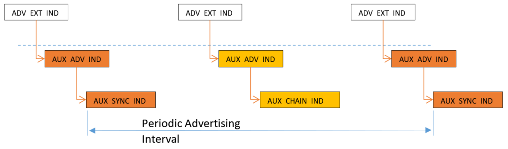
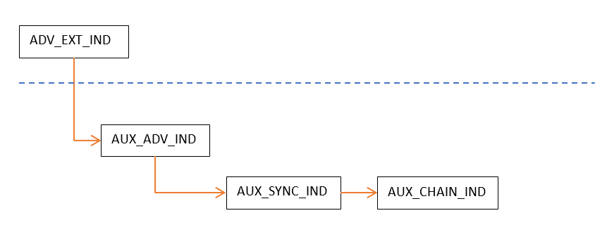

# Periodic Advertising

Periodic channels are used for periodic broadcast between unconnected devices. A periodic channel is represented by a channel map and a set of hopping and timing parameters.

The set of channels is represented by the 37 data channels. A packet sent by an advertiser can also have a payload of up to 255 bytes and it can be sent on any LE PHY. [Figure 8](#perAdv1) and [Figure 9](#perAdv2).  <br>  
**Figure 8. Extended Advertising and Periodic Advertising combined** <br>  
 
 <br>  
**Figure 9. Periodic Advertising – Multiple chains**  



```{include} ../topics/peripheral_setup.md
:heading-offset: 2
```

```{include} ../topics/central_setup_002.md
:heading-offset: 2
```

**Parent topic:**[Generic Access Profile \(GAP\) Layer](../topics/generic_access_profile_gap_layer.md)

