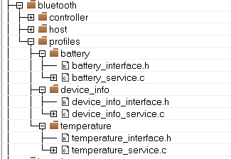

# Profile configuration

The implemented profiles and services are located in *middleware/wireless/bluetooth/profiles* folder. The application links every service source file and interface it needs to implement the profile. For example, for the Temperature Sensor the tree looks as shown [Figure 1](#FIG_UBP_3VF_CY):



The Temperature Profile implements the custom Temperature service, the Battery, and Device Information services.


```{include} ../topics/application_code.md
:heading-offset: 2
```

**Parent topic:**[Application Structure](../topics/application_structure.md)

