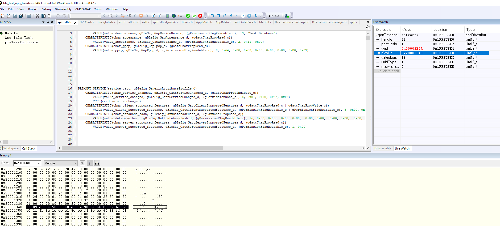

# Robust caching

Robust caching is a feature where the server sends an error response to the client if the server does not consider the client to be aware of a database structural change. A server supporting robust caching provides the Client Supported Features, Database Hash, and Service Changed characteristics. To indicate support for robust caching, clients should write the robust caching bit \(bit 0\) of the Client Supported Features characteristic on the server. An example of the GAP service definition for a server with robust caching support is the following:

-   *PRIMARY\_SERVICE\(service\_gatt, gBleSig\_GenericAttributeProfile\_d\)*
-   *CHARACTERISTIC\(char\_service\_changed, gBleSig\_GattServiceChanged\_d, \(gGattCharPropIndicate\_c\)\)*
-   *VALUE\(value\_service\_changed, gBleSig\_GattServiceChanged\_d, \(gPermissionNone\_c\), 4, 0x01, 0x00, 0xFF, 0xFF\)*
-   *CCCD\(cccd\_service\_changed\)*
-   *CHARACTERISTIC\(char\_client\_supported\_features, gBleSig\_GattClientSupportedFeatures\_d, \(gGattCharPropRead\_c \| gGattCharPropWrite\_c\)\)*
-   *VALUE\(value\_client\_supported\_features, gBleSig\_GattClientSupportedFeatures\_d, \(gPermissionFlagReadable\_c \| gPermissionFlagWritable\_c\), 8, 0x00, 0x00, 0x00, 0x00, 0x00, 0x00, 0x00, 0x00\)*
-   *CHARACTERISTIC\(char\_database\_hash, gBleSig\_GattDatabaseHash\_d, \(gGattCharPropRead\_c\)\)*
-   *VALUE\(value\_database\_hash, gBleSig\_GattDatabaseHash\_d, \(gPermissionFlagReadable\_c\), 16, 0x00, 0x00, 0x00, 0x00, 0x00, 0x00, 0x00, 0x00, 0x00, 0x00, 0x00, 0x00, 0x00, 0x00, 0x00, 0x00\)*

The Client Supported Features characteristic should be declared as an array. The array size is equal to the maximum number of connections, which can be active at one time, so that each possible peer can have its own value. The Server Supported Features characteristic value is automatically written by the Host to indicate robust caching support when appropriate. The Database Hash characteristic value is a 128-bit unsigned integer number where the computed hash value is written.

In order to enable the Robust Caching feature, the *gGattCaching\_d* define should be enabled in the file `app_preinclude.h`. In order to enable automatic Host support for Robust Caching, the *gGattAutomaticRobustCachingSupport\_d*define should also be enabled. This includes writing the Client Supported Features characteristic, writing the CCCD of the Service Changed characteristic, and reading the Database Hash after reconnecting with a previously bonded peer to check for new changes. If this define is not enabled, then it is up to the application to read and write all necessary characteristic for Robust Caching support.

The client state is kept on the server using the following enum:

```
typedef enum
{
gGattClientChangeUnaware_c = 0x00U, /*!< Gatt client state */
gGattClientStateChangePending_c = 0x01U, /*!< Gatt client state */
gGattClientChangeAware_c = 0x02U, /*!< Gatt client state */
} gattCachingClientState_c;
```

The initial state of a client without a trusted relationship is change-aware. The state of a client with a trusted relationship remains unchanged from the previous connection. However, in cases where the database has been updated since the last connection, the initial state is change-unaware. When a database update occurs, all connected clients become change unaware.

If a change-unaware client sends an ATT command, the server ignores it. For ATT requests received from a change-unaware client, the server sends an error response with the error code set to *gAttErrCodeDatabaseOutOfSync\_c*. The server should also not send indications and notifications to change unaware clients, except for the Service Changed indication. The state of a client is verified by the GATT server before executing each command, request or sending any notifications or indications.

The following PDU types are an exception to this rule and do not generate an `gAttErrCodeDatabaseOutOfSync_c` error code:

-   ATT\_FIND\_INFORMATION\_REQ
-   ATT\_FIND\_BY\_TYPE\_VALUE\_REQ
-   ATT\_READ\_BY\_GROUP\_TYPE\_REQ
-   ATT\_EXECUTE\_WRTIE

For a change unaware client to become change aware again, one of the following must happen:

-   The client receives and confirms a Service Changed Indication.
-   The server, upon receiving a request from a change unaware client, sends the client a response with the error code set to `Database Out Of Sync` and then the server receives another ATT request from the client.
-   The change unaware client reads the Database Hash characteristic and then the server receives another ATT request from the client.

The function *GattDb\_ComputeDatabaseHash\(\)* is used by the server to compute the hash value and save its value in the database. The computation is done when a read request for the database hash characteristic is first received from a peer GATT client for dynamic databases.

For static databases, hash computation is disabled by default. If you have a static database and want to compute the database hash, then declare the following define to `TRUE` in `app_preinclude.h`: *gGattDbComputeHash\_d*. By doing this, the hash value is computed during the host initialization. The value is written directly to the database as characteristic and it can be viewed in the memory, as see in the image below. Since static databases do not change in structure over time, this value remains constant, so it can be saved separately and written manually to memory if needed. See Figure 10 below.<br>  

||
**Figure 10. Memory view of the Database Hash characteristic** <br>  
|

|

On the client side, the *GattClient\_GetDatabaseHash\(\)* function is used to read the hash value from a peer GATT server. If the *gGattAutomaticRobustCachingSupport\_c* define is enabled, then the following steps are executed automatically:

-   Writing the Client Supported Features characteristic value to indicate robust caching support – set BIT0 to `1`.
-   Write the CCCD of the Service Changed characteristic.
-   Read the initial value of the Database Hash characteristic and store it locally.

Otherwise, just the read request for the Database Hash characteristic is sent to the peer.

The following arrays and variables are used for the implementations of the robust caching and service changed features \(declared in `ble_globals.c`\):

```
/* Service changed indication buffer */
    gattHandleRange_t gServiceChangedIndicationStorage[gMaxBondedDevices_c];

/* client saved values for service changed characteristic and CCCD handles */
    uint16_t mActiveServiceChangedCharHandle[gAppMaxConnections_c] = {gGattDbInvalidHandle_d};
    uint16_t mServiceChangedCharHandle[gMaxBondedDevices_c] = {gGattDbInvalidHandle_d};
    uint16_t mActiveServiceChangedCCCDHandle[gAppMaxConnections_c] = {gGattDbInvalidHandle_d};

/* server values for its own service changed characteristic and CCCD handles */
    uint16_t mServerServiceChangedCharHandle;
    uint16_t mServerServiceChangedCCCDHandle;

/* client state information for bonded and active clients */
    gattCachingClientState_c gGattClientState[gMaxBondedDevices_c] = {gGattClientChangeAware_c};
    gattCachingClientState_c gGattActiveClientState[gAppMaxConnections_c] = {gGattClientChangeAware_c};

/* Database hash values - the client needs a hash value for each possible peer */
    uint8_t mGattActiveServerDatabaseHash[gGattDatabaseHashSize_c * gAppMaxConnections_c] = {0};
    uint8_t mGattServerDatabaseHash[gGattDatabaseHashSize_c * gMaxBondedDevices_c] = {0};

/* client supported features handles for active gatt servers */
    uint16_t gGattActiveClientSupportedFeaturesHandles[gAppMaxConnections_c] = {gGattDbInvalidHandle_d};

/* client supported features information for bonded gatt clients */
    uint8_t gGattClientSupportedFeatures[gMaxBondedDevices_c] = {0U};

/* index of the database hash characteristic in the database */
    uint32_t mServerDatabaseHashIndex = gGattDbInvalidHandleIndex_d;

/* index of the client supported features characteristic in the database */
    uint32_t mServerClientSupportedFeatureIndex = gGattDbInvalidHandleIndex_d;
```

It is up to the application to save a local copy of the information from the server’s database and to initiate service discovery only on the first connection or when it is informed of a change by the peer using Service Changed and Robust Caching.

If the *gGattAutomaticRobustCachingSupport\_c* define is not set, it is up to the application to check the Server Supported Features characteristic value on the peer, to write the Client Supported Features characteristic value and to write the Service Changed CCCD.

Two new GATT procedures are introduced as part of the Robust Caching feature. Both should be treated according to the application needs in the GATT procedure callback of the application.

-   *gGattProcSignalServiceDiscoveryComplete\_c –*informs the application that the service discovery procedure has finished after reading the Database Hash value using the read using characteristic UUID procedure. The application procedure callback should call *BleServDisc\_Finished\(\)*on this event when robust caching is supported.
-   *gGattProcUpdateDatabaseCopy\_c –*informs the application that its database copy is no longer up to date and service discovery should be reperformed. Used when the client received an error response with the *gAttErrCodeDatabaseOutOfSync\_c* opcode, when the local database hash value is found to be out of sync with the one on the server, or when a service changed indication is received from the server.

If service discovery is performed using our ble\_service\_discovery module, then the application should wait for the *gDiscoveryFinished\_c* event before initiating its own GATT procedures. The application should also make sure to not initiate a second GATT procedure which requires a response from the peer before receiving a response to the first request it made.

**Parent topic:**[Gatt caching](../topics/gatt_caching.md)

