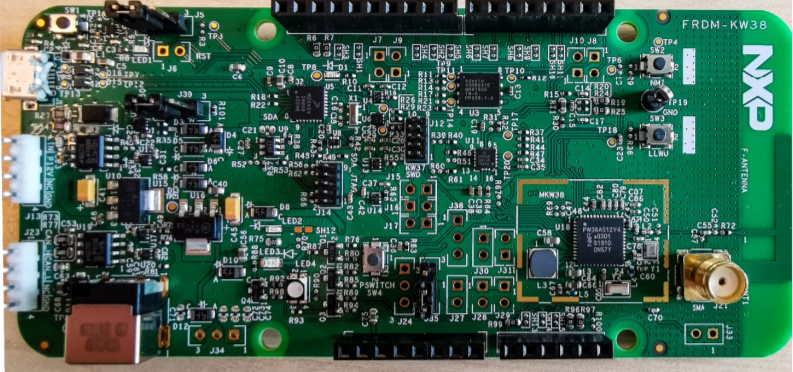

# CCC Digital Key hardware platforms

The CCC Digital Key R3 demo applications support the following platforms that have Bluetooth Low Energy transceiver capabilities:

-   FRDM-KW38 \(see [Figure 1](#FIG_O4F_ZY1_JLB)\)

-   KW45B41Z-EVK \(see [Figure 2](#FIG2_O4tuF_ZY1_JLB)\)

-   KW47-EVK \(see [Figure 3](#FIG3_O4tuF_ZY1_JLB) \)

