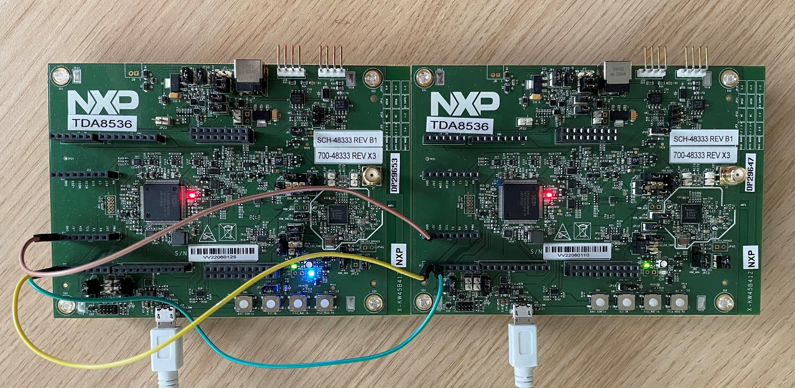
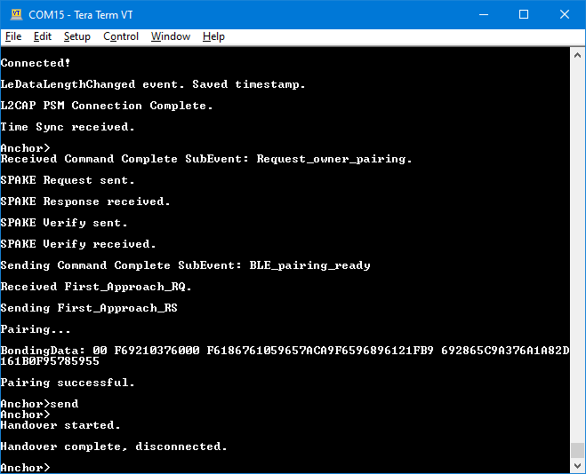
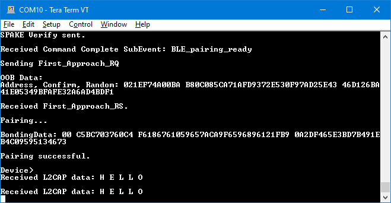

# Running the Connection Handover scenario

Connection Handover is an NXP proprietary feature that enables a Bluetooth Low Energy connection to be seamlessly transferred from one peripheral to another while the central device remains unaware. It is best exemplified by \(but not limited to\) the CCC Digital Key use case. As a person carrying a phone moves around the vehicle, the Bluetooth Low Energy connection is transferred between Car Anchors in order to ensure the best user experience. From the Device’s point of view, it stays in the same initial connection.

The CCC Digital Key demos showcase the Connection Handover feature. The handover is performed on demand via a button press. In a real scenario, the handover is performed based on criteria such as RSSI. The feature is currently supported on the KW45B41Z-EVK and KW47-EVK platforms.

**Prerequisites**:

-   Three boards \(two boards act as Car Anchors, one as a Device\). The demo is currently limited to a maximum of two Car Anchors.
-   The two Car Anchors must have a serial connection via the secondary UART as shown in the image below. The UART connection stands in for a real deployment solution such as a CAN bus.
-   The *gHandoverDemo\_d* macro must be set to `1` in *`app_preinclude.h`* for the ***digital\_key\_car\_anchor*** project. [Figure 1](#FIG1_HTH_GHJ_5TB) shows KW45B41Z-EVK car anchors connected via secondary UART. *\(J1-1 is connected to J1-2 and J1-2 is connected to J1-1. GND connection is J13-1 to J13-1.\)*
-   If KW47-EVK boards are used, make the UART connection between J1-1 to J1-3 and J1-3 to J1-1.



**Demo steps**:

-   Connect a Car Anchor and a Device using either the Owner Pairing or Passive Entry scenario as detailed in the previous sections. If doing Owner Pairing, the bonding data synchronization between the two Car Anchors will happen automatically over the UART connection.
-   Optional: Use the "`send`" shell command on the Car Anchor to send a test message over the L2CAP Credit-Based channel. The message is displayed in the console on the Device.
-   Press the **SW3** switch on the Car Anchor which is connected to the Device.
-   The connection is handed over to the second Car Anchor as seen in console messages. LED2 also turns solid blue on the Car Anchor, which has taken over the connection.
-   **Optional**: Use the "`send`" shell command on the Car Anchor that has taken over the connection. The message is displayed in the console on the Device.
-   The connection can continue to be handed over back and forth between the two Car Anchors by pressing the **SW3** switch on the Car Anchor which currently has the connection. [Figure 2](#FIG2_ZKV_Y3J_5TB) shows first Car Anchor connects and pairs with the Device, sends the L2CAP test message and successfully performs handover when **SW3** is pressed.



[Figure 3](#FIG3_ZKV) shows that the second Car Anchor receives the bonding data automatically via UART when the first Car Anchor pairs with the Device. After the handover is successfully completed, it sends the L2CAP test message to the Device.


[Figure 4](#FIG4_ZKV) shows the Device receiving both L2CAP test messages. From the device's point of view, it is in a single uninterrupted connection.




```{include} ../topics/running_the_anchor_monitoring_scenario.md
:heading-offset: 1
```

```{include} ../topics/Running_the_Packet_Monitoring_scenario.md
:heading-offset: 1
```

