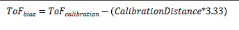

# Zero distance calibration (ToFbias)

The ToF calculation must account for any systematic offsets in the calculation, which may be contributed by the specific choice of receive and transmit trigger anchors in the exchanged packets, as well as radio-specific implementation, such as data path latencies, delays, and so on. This systematic offset in ToF computations may be eliminated via characterization or calibration.

For both the transmitted and received packets, the location of the anchor points in the packet that are timestamped are known. Combining this knowledge of anchor triggers to the ToF packet format and communication data rate, the theoretical time delay between a packet transmission by a device and its reception by another device for a known reference distance could be precisely computed if the data path latencies in the transceiver chain were negligible or precisely known. For ToF distance estimation, the timing resolution that must be resolved is in nanoseconds. This requires a reference physical measurement to have a precise measurement of the Radio Frequency (RF), analog and digital data path latencies, as well as other implementation delays in the control path.

For this purpose, a calibration method is implemented by placing both devices (MD and RD) at a known distance and perform average ToF measurements over a set of exchanged packets. This enables the computation of averaged ToFbias, which is calculated according to [Equation 10](../images/eq10.png "ToF bias").

**Equation 10. ToF bias**

The ToF measurement is also impacted by propagation delay variation in the RF/analog front end of the radio as a function of the Automatic Gain Control (AGC) step in use. It is recommended to perform the ToF zero-distance calibration at a known distance and gain the configuration of the radio. For a random distance measurement using ToF, the knowledge of the receiver’s gain during the measurement and its relationship to the gain value used during the zero distance calibration may be used to compensate for the subsequent ToF measurements.

**Parent topic:**[ToF Multistage](../topics/tof_multistage.md)
