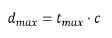
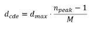
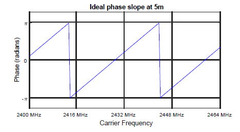
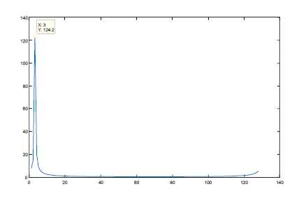
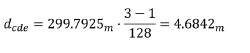

# Complex Distance Estimation (CDE)

In CDE, the phase measurements taken at each frequency are converted into a complex signal in the frequency domain. By transforming it to the time domain using the Inverse Fast Fourier Transform (IFFT), we obtain the distribution of the propagation delays that are in the signal.

The maximum propagation delay that can be measured without ambiguity is determined by the spacing between the measurement frequencies (Δf) and it is given by the following equation:

**Equation 18. Largest unambiguous propagation delay measurable using the CDE method**

The maximum measurable distance can be obtained by multiplying the maximum propagation speed by the speed of light (c):

**Equation 19. Maximum distance measurable using the CDE method**

The distance estimate is obtained using the following equation:

**Equation 20. CDE distance calculation**

Where npeakis the bin with the highest peak, M is the number of bins used in the IFFT, and dmax is the largest unambiguous distance.
Let’s assume an ideal phase difference response for two boards separated by 5 m. The phase difference is measured using Δf = 500 kHz. The maximum measurable distance is given by the following equation:

**Equation 21. Maximum distance measurable using Δf = 500 kHz**

The wrapped phase response obtained from the frequency sweep at the same distance (see [Figure 20](../images/fig20.png "Phase slope at 5 m")) is shown in [Figure 22](../images/fig22.png "Ideal phase slope at 5 m using Δf = 500 kHz").

**Ideal phase slope at 5 m using Δf = 500 kHz**

If a 128-bin FFT is applied to an array containing the wrapped phase points in their rectangular form, the output is shown in Figure 23.

**Ideal 128-bin IFFT for the 5-m slope**

The bin holding the biggest peak is number 3. Use the following equation to obtain the estimated distance:

**Distance calculation for bin 3 using 128-bin FFTe**

The resolution of the measured distance depends on the frequency step selected and the number of bins used in the IFFT.

**Parent topic:**[RTP estimation fundamentals](../topics/rtp_estimation_fundamentals.md)
