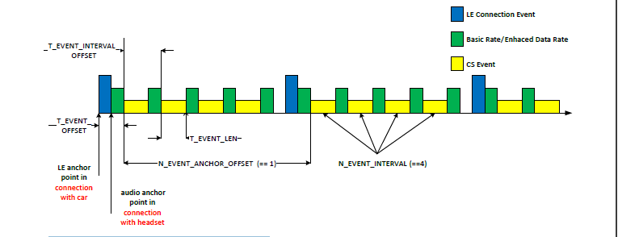

# The CS high-level view

The high-level view of the several procedures needed for the distance estimation is shown in **Distance estimation - high-level view**
. A simple flowchart shows the procedures described in the CS standard. It also contains yellow boxes, which are not directly defined by the CS standard. The data exchange between the initiator and the reflector cover for example the IQ data, RTT timestamps, and so on. The data exchange is planned to be a part of the ranging service profile.

**Distance estimation - high-level view**

The example of the CS events interleaved with LE connection events is shown in [Figure 4](../images/fig4.png "CS event scheduling in coexistence scenario"). This should improve the understanding how the CS events are interleaved with the LE connection events. The CS events are scheduled at an offset from the LE connection anchor points. Only 1 CS event is scheduled in this scheme. As an example, a smartphone in a key fob role may be connected to an automobile for localization purposes. The connection interval of this LE connection may be very long, because its main purpose is to start CS procedures.

**CS event scheduling in coexistence scenario**

At the same time, the phone may be connected to a headset for audio connection purposes. To allow for flexible scheduling of CS events, multiple CS events can be scheduled offset from single LE connection events. A CS event offset is used to separate the multiple CS events in time. The number of CS events allowed in between LE connection events is selectable.

**Parent topic:**[The channel sounding standard description](../topics/cs_standard_description.md)