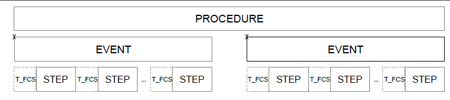

# The channel sounding procedure description

The CS procedure consists of several events that are defined as a set of time and frequency slots, in which 2 devices agree to communicate and exchange a combination of RF signals. The main purpose of this exchange is to estimate the physical characteristics of the transmission channel. These exchanges are always bidirectional.

The CS procedure is divided into one or more events. The CS event can consist of one or more CS steps that are separated by a frequency change period called T_FCS. Time separation between CS events avoids continuous allocation of the RF resources of a given device and facilitates coexistence with other RF technologies. [Figure 2](../images/fig2.png "Channel Sounding procedure composition") shows the relationship between CS procedures, CS events, and CS steps.

**Channel Sounding procedure composition**

Each CS event has a separate anchor point labeled ‘X’. The link layer configures devices to run this procedure. It defines all the steps for these events in both time and frequency relative to these anchor points. The output of the CS procedure is a table of phase correction terms for both the initiator and the reflector and/or a table of time stamps. The processing algorithms translate those tables into distance estimates. The processing algorithms are not part of the standard. The procedure is composed of one or more CS events. The CS event is composed of the multiple CS steps. There can be programmable gaps between CS events to allow other simultaneous connections.

Four CS step types (mode 0, mode 1, mode 2, and mode 3) are defined. Each mode is used for a specific purpose:
-   Mode 0 is used to calibrate 1 side to the other in terms of frequency and timing.
-   Mode 1 is used to exchange a Round Trip Timing (RTT) packet.
-   Mode 2 is used to exchange Round Trip Phase (RTP) packets and to measure the phase and amplitude of the communication channel.
-   Mode 3 is used to exchange both RTT and RTP measurement packets.

In the CS context, an initiator is the device that starts (initiates) the whole procedure and a reflector is the device that responds to (reflects) the CS procedure. The procedure’s operating parameters are exchanged via link layer control messages. Once the procedure completes, each device has a set of information that describe the real communication channel. Mode 1 and mode 3 measure the time of arrival and the time of departure. Mode 2 and mode 3 measure the phase and amplitude information in the form of in-phase (I) and quadrature-phase (Q) components. The reflector communicates this information back to the initiator. The following chapters describe 4 different step types.

**Parent topic:**[The channel sounding standard description](../topics/cs_standard_description.md)