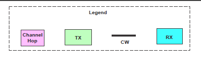
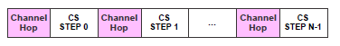

# Channel Sounding steps description

The CS defines a set of interlocked transfers between initiator and reflector. Within a CS procedure, CSStepCount shall be set to the current CS step number. The CS steps are constructed by a combination of modulated and unmodulated RF signals. The modulated sections convey synchronization information and extract the round-trip time information. The unmodulated sections are used to measure the phase rotation, which is proportional to the distance between the devices. The CS steps use the dedicated packet formats. There are 4 different modes for the CS steps. Each of these modes has different usage goals: measuring frequency offset between devices (mode 0), measuring round-trip times (mode 1), measuring phase rotations due to distance (mode 2), and measuring both round-trip times and phase rotations (mode 3). The CS steps require a precise timing synchronization between the initiator and reflector devices. [Figure 5](../images/fig5.png "Legend for CS step type packet description") shows a legend of the diagrams used in the following chapters to describe individual CS step modes.

**Legend for CS step type packet description**


The colored time slots represent the following:
-   Channel Hop time slot
-   TX - transmitting time slot
-   CW - unmodulated continuous wave signal
-   RX - receiving time slot


The CS steps are separated by periods to perform a frequency hop. The structure is shown in [Figure 6](../images/fig6.png "Channel hop period separates CS steps").


**Channel hop period separates CS steps**



The time for the frequency hop is known as T_FCS. The initiator and reflector devices exchange the list of T_FCS values that each one can support during the capability procedure. The initiator selects a common T_FCS value during the configuration procedure. The permitted values for T_FCS are given by the BLE standard. Within a CS procedure, the same T_FCS value should be used for each channel hop. Both devices use the T_FCS period to perform internal calibrations in addition to the frequency change. The initiator or reflector may use this time period to allow the settling of the transmitted RF signal. It means that it reached a stable state when the subsequent CS step begins.

The set of variables used in the following chapters describes the CS step modes, as shown in Table 3.

Table 3. Channel Sounding step variables

| Variable | Description  | Time duration [us] |
| ----------- | ----------- | ----------- |
| T_FCS | Time for frequency change spacing. The RF circuitry locks to the measurement channel (f_i). Devices can also use this time for additional internal calibrations, if necessary. The initiator may start to ramp up its output signal toward the end of this step |  15, 20, 30, 40, 50, 60, 80, 100, 120, 150 |
| T_FM | Time for frequency measurement | 80 |
| T_SY | Time for synchronization sequence (CS packet) | 26 for 2M PHY, 44 for 1M PHY |
| T_IP1 | Interlude period 1. The transition from TX to RX and the other way around when transmitting in mode 1 (Pk-Pk). | 10, 20, 30, 40, 50, 60, 80, 145 |
| T_IP2 | Interlude period 2. The transition from TX to RX and the other way around when transmitting in mode 2 (Tn-Tn). | 10, 20, 30, 40, 50, 60, 80, 145 |
| T_GD | Transition time between packet and tone | 10 |
| T_RD | Ramp-down time for transmission | 5 |
| T_PM | Single-antenna phase measurement period | 10, 20, 40 |
| N_AP | Number of antenna paths | 1, 2, 3, 4 |
| T_SW | Antenna switching period | 1, 2, 4, 10 |
| N_AP*T_PM | Phase measurement period. This measurement must be performed for each antenna path. N_AP is the total number of antenna paths. Transmitted signals are expected to be stable during this period. When multiple antenna paths are used, an equivalent number of T_PM periods is used. Each T_PM reserves the first 2 us for antenna switching (T_SW). | - |

```{include} ../topics/cs_steps_mode0.md
:heading-offset: 1
```

```{include} ../topics/cs_steps_mode1.md
:heading-offset: 1
```

```{include} ../topics/cs_steps_mode2.md
:heading-offset: 1
```

```{include} ../topics/cs_steps_mode3.md
:heading-offset: 1
```

```{include} ../topics/cs_steps_mode_seq.md
:heading-offset: 1
```

**Parent topic:**[The channel sounding standard description](../topics/cs_standard_description.md)