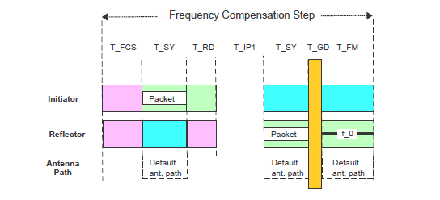
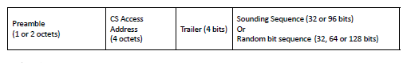

# CS step mode 0

TCS step mode 0 is used to measure the frequency offset between the initiator and the reflector at a given frequency. The step mode 0 is a basic step supported by all the devices with CS feature. [Figure 7](../images/fig7.png "CS step Mode 0 packet exchange") shows the exchange defined for CS step mode 0.

**CS step Mode 0 packet exchange**

The frequency hop is created before each CS step. The initiator starts by transmitting the CS SYNC packet (T_SY). The duration of the packet is shown in Table 3. The initiator performs a measurement of the frequency offset from the transmitted RF signals from the reflector during CS step mode 0. The initiator shall use this information to compensate all further transmissions within the subsequent CS steps in a CS event. This is used for synchronization purposes.

After the transmission from the initiator completes, a defined ramp-down window of 5 us (T_RD) is allowed for the initiator to remove the transmitted energy from the RF channel. After T_RD, the output power shall be lower by 40 dB than the output power used during the transmission of the CS SYNC packet (measured at the initiator’s antenna).

T_IP1 represents the idle time between the transmission from the initiator and the transmission from the reflector. Devices may use this time for internal calibrations, if needed. The reflector can use this time to ramp up its transmitted signal (if necessary) in advance of the transmission of the CS SYNC packet (T_SY) with the unmodulated carrier after synchronization. A transition time from packet to tone (T_GD) is needed. Then the reflector device makes the frequency-measurement period. The duration of this period (T_FM) for CS mode 0 shall be 80 us. The frequency measurement period ends the CS step mode 0 procedure.

It is important to mention 2 packet formats for channel sounding. Channel sounding uses a specific modulated bit sequence known as CS SYNC. The CS SYNC packet format is similar to a packet format for uncoded PHY, but it has no CRC. The CS SYNC packet has a specific format shown in [Figure 8](../images/fig8.png "CS SYNC packet format").

**CS SYNC packet format**

The preamble is 1 octet when transmitting or receiving on the LE 1M PHY and 2 octets when transmitting or receiving on the LE 2M PHY. The CS access address is 4 octets. The trailer is 4 bits. The sounding sequence or random bit sequence are optional fields. If present, the sounding sequence shall be 32 or 96 bits long. If the random bit sequence is present, it shall be 32, 64, or 128 bits long.

The variable length of the optional sounding sequence and random bit sequence allows an implementation to optimize the total packet length vs the correlation accuracy of the field. CS packets with no sounding or random bit sequence take 44 us to transmit when sent by LE 1M PHY and 26 us to transmit when sent by LE 2M PHY. CS packets that include a sounding or random bit sequence take proportionally longer to transmit, based on the length of the field and the PHY selection.

**Parent topic:**[The channel sounding steps description](../topics/cs_steps_description.md)