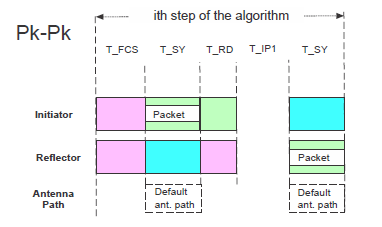

# CS step mode 1

CS mode 1 is used to measure the round-trip time between the initiator and the reflector. Devices supporting the CS feature shall implement the CS step mode 1. This mode uses the theoretical background described in RTT estimation fundamentals. The packet structure in [Figure 9](../images/fig9.png "CS step mode 1 packet exchange") is defined for CS step mode 1. Before each CS step, a frequency hop is created

**CS step mode 1 packet exchange**

The initiator starts by transmitting the CS SYNC packet. The duration of the CS SYNC packet is marked as T_SY. In this case, CS step mode 1 may include a payload as part of the CS SYNC packet. After the transmission from the initiator completes, a defined ramp down window of 5 us is allowed. It helps the initiator to remove the transmitted energy from the RF channel. After the ramp down, the output power shall be lower by 40 dB than the output power used during the transmission of the packet, measured at the initiator’s antenna.

T_IP1 represents the idle time between the transmission from the initiator and the transmission from the reflector. Devices may use this time for internal calibrations, if needed. The reflector can use this time to ramp up its transmitted signal (if necessary) in advance of the transmission of the CS SYNC packet. The duration of T_IP1 is shown in Table 3. After T_IP1, the reflector device transmits its CS SYNC packet. The CS step mode 1 may have a payload as part of the CS SYNC packet. The reflector may transmit its CS SYNC packet even if it does not receive a previous CS SYNC packet from the initiator or if the CS SYNC packet was received with bit errors.

**Parent topic:**[The channel sounding steps description](../topics/cs_steps_description.md)