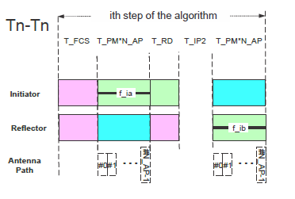

# CS step mode 2

CS mode 2 is used to measure the phase rotations of the RF signal between the initiator and the reflector. The theoretical description of this mode is in RTP estimation fundamentals. The devices supporting this feature should fully support CS step mode 2. The structure of CS step mode 2 is shown in [Figure 10](../images/fig10.png "CS step mode 2 tone exchange").

**CS step mode 2 tone exchange**

Before each CS step, a frequency hop is created. The duration of the frequency hop is marked as T_FC. The initiator starts the transmission with an Unmodulated Carrier (UC) RF signal. The duration of the unmodulated carrier RF signal should be T_PM*N_AP, where T_PM is the phase-measurement period and N_AP is the number of antenna paths. Each individual T_PM reserves the first configurable time (1, 2, 4, 10 us) for antenna switching. The available values of T_PM are given by the standard and shown in Table 4.

Table 4. Permitted values for T_PM

| T_PM Index | T_PM  | Comment |
| ---------- | ----- | ------- |
| 1 | 10 us | Optional |
| 2 | 20 us | Mandatory if any shorter T_PM extent is supported, else optional |
| 3 | 40 us | Mandatory |

For added security, each N_AP set of T_PM length transmissions shall be followed by a single tone-extension slot of the same T_PM extent. This tone-extension slot may or may not carry a transmission. The presence of the added security is controlled by random bit generation.

After the transmission from the initiator completes, a defined ramp-down window of 5 us is allowed for the initiator to remove the transmitted energy from the RF channel. The same rule is applied here. The output power shall be lower by 40 dB than the output power used during the transmission of the UC RF signal. The signal level is measured at the initiator’s antenna. T_IP2 represents the idle time between the transmission including the tone extension slot from the initiator and the transmission from the reflector. Devices may use this time for internal calibrations (if needed). The reflector can use this time to ramp up its transmitted signal (if necessary) in advance of the transmission of the UC. The permitted values for T_IP2 are shown in Table 5. The T_IP1 value can be different from T_IP2.

Table 5. Permitted values for T_IP2

| T_IP2 Index | T_IP2  | Description |
| -------- | ------ | ------- |
| 1 | 10 us  | Optional |
| 2 | 20 us  | Optional |
| 3 | 30 us  | Optional |
| 4 | 40 us  | Mandatory if any shorter T_PM extent is supported, else optional |
| 5 | 50 us  | Optional |
| 6 | 60 us  | Optional |
| 7 | 80 us  | Mandatory if any shorter T_PM extent is supported, else optional |
| 8 | 145 us | Mandatory |

After T_IP2, the reflector device transmits its (UC) RF signal. The duration of the unmodulated carrier RF signal should be T_PM*N_AP, where T_PM is the phase-measurement period and N_AP is the number of antenna paths. Each individual T_PM reserves the first 2 us for antenna switching. The N_AP parameter is common to the entire CS procedure and shall range from 1 to 4. An added extension transmission slot shall immediately follow the last valid N_AP transmission, as it was similarly present in the initiator-to-reflector direction. If a transmission is present, it shall be identical to that of the last T_PM slot and it shall use the same antenna element used in that slot. If a transmission is not present in the tone-extension slot, then that T_PM period shall still be present but not carry a transmission. The presence of the added security is controlled by the random bit generation.

**Parent topic:**[The channel sounding steps description](../topics/cs_steps_description.md)