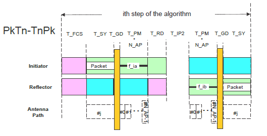

# CS step mode 3

CS step mode 3 is used to measure the phase rotations of the RF signal and the round-trip time between the initiator and the reflector. It uses a combination of the previous modes. All the devices supporting the CS feature may optionally implement also step mode 3. [Figure 11](../images/fig11.png "CS step mode 3 packet exchange") is defined for CS step mode 3.

**CS step mode 3 packet exchange**

A frequency hop is created before each CS step. The channel hop duration is marked as T_FCS. In the reflector to initiator direction, the duration is given by the CS SYNC synchronization packet (T_SY), transition time between the packet mode to tone (T_GD), and the unmodulated carrier RF signal T_PM*N_AP. T_PM is the phase-measurement period and N_AP is the number of antenna paths. Each individual T_PM reserves the first configurable time (1, 2, 4, 10 us) for the antenna switching (T_SW).

If a tone-extension slot is present, then the tone duration is (T_SW+T_PM)x(N_AP+1). If the tone-extension slot is not present, then the tone duration is (T_SW+T_PM) x N_AP. To compensate for the missing tone slot a “no tone” slot is added after the synchronization.

The initiator starts a transmission with the Unmodulated Carrier (UC) RF signal. The duration of the unmodulated carrier RF signal should be T_PM*(N_AP + 1) and it should also depend on the physical layer used. CS step mode 3 may use a payload as part of the synchronization.

For added security, each N_AP set of T_PM length transmissions shall be followed by a single tone-extension slot of the same T_PM extent. This tone-extension slot may or may not carry a transmission. If a transmission is present, it shall be identical to that of the last T_PM slot and it shall use the same antenna element used in that slot. If a transmission is not present in the tone-extension slot, then that T_PM period shall still be present, but it shall not carry a transmission. The presence of a physical transmission in the extension transmission slot is seeded by the random bit generation.

After the transmission from the initiator is completed, a defined ramp down window of 5 us (T_RD) is allowed for the initiator to remove the transmitted energy from the RF channel. After T_RD, the output power should be lower by 40 dB than the output power during the transmission of the synchronization. This is measured at the initiator’s antenna.

T_IP2 represents the idle time between the transmission from the initiator and the reflector. Devices may use this time for internal calibrations (if needed). The reflector can use this time to ramp up its transmitted signal before the transmission. The duration of T_IP2 is defined the same way as the CS step mode 2 in Table 5.

After T_IP2, the reflector device transmits a CS synchronization using the unmodulated carrier. The duration of the unmodulated carrier shall
be either T_PMxN_AP or T_PMx(N_AP + 1). This depends on whether a transmission is selected for the tone­ extension slot. If a transmission is present, it should be identical to that of the last T_PM slot and it shall use the same antenna element as in that slot. If a transmission is not present in the tone-extension slot, then the T_PM period should not be present. The presence of a physical transmission in the extension is controlled by the random bit generation.

The reflector device may then transmit its CS synchronization even if it does not receive a CS synchronization from the initiator or if the synchronization was received with bit errors.

**Parent topic:**[The channel sounding steps description](../topics/cs_steps_description.md)