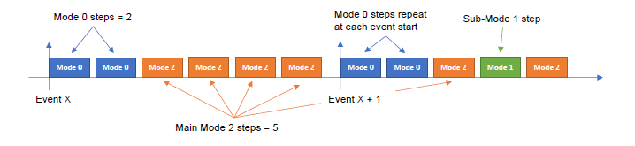

# Channel Sounding mode sequencing

The CS mode sequencing describes specific time slots of the whole flow. The CS event will always start with one or more mode 0 steps, which is represented by blue rectangles in F[Figure 12](../images/fig12.png "Channel Sounding mode sequencing"). A series of subsequent non-mode 0 steps shall follow in the same event. Any CS procedure shall only use at most two non-mode 0 modes. One of these two is known as the main mode and the other is known as the submode. An example of this sequencing is shown in Figure 12. Many other CS mode sequencing examples can be generated.

**Channel Sounding mode sequencing**

The submode insertion sequences the occurrence of the main mode steps and the submode steps and uses the following parameters:
-   Main_Mode_Min_Steps – the minimum main-mode steps that shall occur before a single submode step.
-   Main_Mode_Max_Steps – the maximum main-mode steps that shall occur before a single submode step.

The number of main-mode steps that occur before a submode step shall be between Main_Mode_Min_Steps and Main_Mode_Max_Steps, inclusive. The exact number of main-mode steps that occur before a submode step insertion is randomized for each sequence. The randomized function is defined by the BLE standard.

**Parent topic:**[The channel sounding steps description](../topics/cs_steps_description.md)