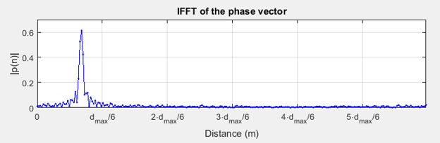

# Distance estimation

After the IQ samples are captured on each device, the phase difference is obtained using the following equation:

The phase vector obtained as a result of phase processing is the input for the distance-estimation algorithm. It can be used directly with Equation 16 for the slope method or as an IFFT input for the CDE method.

**IFFT of phase vector**

[Figure 28](../images/fig28.png "IFFT of phase vector") shows the IFFT magnitude response of the phase vector illustrated in [Figure 27](../images/fig27.png "Phase measurements (unwrapped) across multiple carrier frequencies"). The labels on the x-axis show the distance in meters. The final estimate is generally obtained from the peak location of the IFFT. The zero-meter compensation may be necessary to account for the delays within the radio front end.

**Parent topic:**[PDE](../topics/pde.md)
