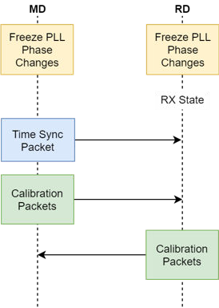

# Initialization and calibration

Before capturing the IQ samples, four important conditions must be met:
1. All transceiver impairments that can impact the phase capture information (DC offsets, IQ mismatch, filtering transfer function contributions, PLL phase excursions, and so on) must be minimized.
2. Theoretically, the IQ signal amplitude does not affect the phase calculations. However, signal saturation or fading can affect the accuracy of phase calculations. Ensure a good dynamic range for the captured IQ samples.
3. The measurement of phase differences implies that changes in phase are only produced by the distance between the test devices. The PLLs in both devices must remain frequency-coherent throughout the capture process.
4. Some algorithms require changing the tone frequencies with a specific time interval. The devices must synchronize their transmit and receive cycles accordingly.

The initialization and calibration stages ensure that all of the above conditions are met before capturing the IQ samples.

**Initialization and calibration sequence**

**Parent topic:**[PDE](../topics/pde.md)
