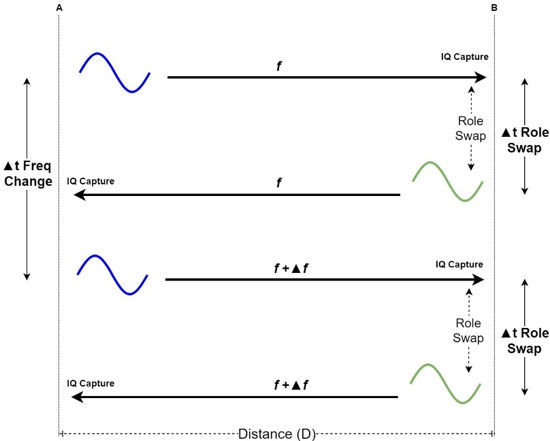

# IQ data capture

Two-way PDE algorithms use multiple phase differences obtained at several frequencies. To achieve this, the MD and RD must generate Continuous-Wave (CW) tones and capture IQ samples in all the measurement frequencies.

The base mechanism consists of device A, which generates a tone at frequency f. At the same time, the peer device B sets its radio to the RX mode at f and starts to capture IQ samples. After a fixed amount of time, devices A and B change roles. Now device B generates a tone in f and device A starts the RX and IQ capture at f. This is a tone exchange sequence.

After the tone exchange sequence ends, both devices return to their original roles, but the frequency is updated by Δf. For this new tone exchange, device A generates a tone at f + Δf. Device B also sets its radio to the RX mode at f + Δf and captures IQ samples. The tone exchange sequence is repeated for all frequency values that are defined for this measurement

**Multiple frequency IQ samples capture sequence**

**Parent topic:**[PDE](../topics/pde.md)
