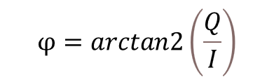

# Phase processing

After the IQ samples are captured on each device, the phase difference is obtained using the following equation:

**Equation 22. Phase from IQ samples**

Each device holds the phase difference slope of the peer device against its own local oscillator. To obtain the phase combination result of the distance, the phase slope from the RD must be added to the phase slope from the MD.

**Equation 23. Phase vector combination**

This phase slope can now be used to perform distance estimation. As shown in Figure 21, depending on the frequencies used and the measured distance, phase wraps may occur.

[Figure 27](../images/fig27.png "Phase measurements (unwrapped) across multiple carrier frequencies") shows how the measured phase values change as a function of the carrier-frequency index. The data for this example is obtained using a wired setup, where the two devices are connected by a cable. A total of 99 carriers are used with the first carrier (index 2) corresponding to a frequency of 2400.5 MHz. The last carrier (with index 100) corresponds to a frequency of 2449.5 MHz. The frequency step size is 500 kHz.

**Phase measurements (unwrapped) across multiple carrier frequencies**

 across multiple carrier frequencies")

**Parent topic:**[PDE](../topics/pde.md)
