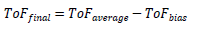
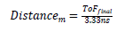

# Postprocessing

The postprocessing step is typically applied over a set of individual ToF measurements with a goal to choose a reliable distance estimate from several single-shot measurements that may be individually lacking both accuracy and resolution. Statistical estimation techniques must be applied in this step to the collected data set. As an example, the postprocessing step can include data-processing techniques, calculation of a statistical average (ToFaverage, mean or median), weighted averages, and so on. It may include statistical tests for outlier rejection (among others) to improve ToF accuracy.

To cancel systematic delays in a ToF measurement, one option is to perform a calibration to estimate the bias that must be subtracted from ToFaverage. Such bias method can be carried out at a fixed distance between the two nodes. ToF is given as [Equation 8](../images/eq8.png "ToF after bias").

**Equation 8. ToF after bias**

When a ToFfinal value is calculated, the distance between the two wireless nodes may be estimated by dividing ToFfinal by the ideal ToF value expected for a reference distance of 1 m ([Equation 9](../images/eq9.png "Distance estimation")).

**Equation 9. Distance estimation**

The measurement report is created when the calculated distance estimate is ready. The measuring device reports the estimated distance and an indication that the measurement is complete.

**Parent topic:**[ToF Multistage](../topics/tof_multistage.md)
