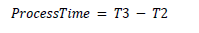
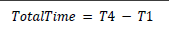
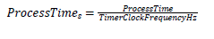
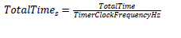
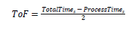
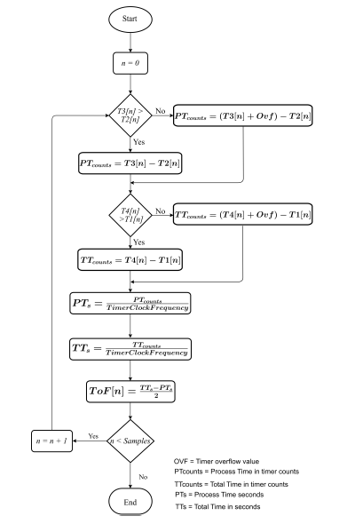

# Preprocessing

With the timestamps already generated and stored at MD, the pre-processing stage calculates a ToF estimate for every T1 – T4 sample set. Such calculations can be performed using integer math. However, to improve the measurement accuracy, fixed-point or floating-point math can be used. To calculate each ToF estimate, the system performs the following steps:

1. Calculate the process time in function of timer counts. Any timer overflow must be accounted in [Equation 3](../images/eq3.png "Process time calculation").

**Equation 3. Process time calculation**

2. Calculate the total time in function of timer counts. Any timer overflow must be accounted in [Equation 4](../images/eq4.png "Total time calculation").

**Equation 4. Total time calculation**

3. Translate the process time from TimerClockFrequencyHz counts to seconds, as shown in [Equation 5](../images/eq5.png "Process time to seconds").

**Equation 5. Process time to seconds**

4. Translate the total time from TimerClockFrequencyHz counts to seconds, as shown in [Equation 6](../images/eq6.png "Total time to seconds").

**Equation 6. Total time to seconds**

5. Calculate the ToF per sample, as shown in Equation 7.

**Equation 7. ToF in seconds**

[Figure 18](../images/fig18.png "Individual ToF measurement and preprocessing flowchart") shows the previously discussed steps for n samples.

**Individual ToF measurement and preprocessing flowchart**

For a radio, it is typical to exercise the receiver’s Automatic Gain Control (AGC) dynamic range to operate over the entire link budget or in response to the presence of interference. The AGC operation typically ensures that a certain level of down-converted signal is maintained at the receiver’s Analog-to-Digital Conversion (ADC) over the receiver’s entire dynamic range, until the receiver gain hits either a minimum or a maximum. Since the measurement resolution targeted in the ranging-distance estimates is in nano-seconds, any propagation time variability within the radio’s analog front end due to gain adaptation must be carefully treated as a potential source of error, while performing the ToF distance estimation. This can be avoided by either performing a gain vs time propagation variability calibration. This can be addressed by choosing a robust method to choose an optimal AGC setting for a ToF measurement.

**Parent topic:**[ToF Multistage](../topics/tof_multistage.md)
