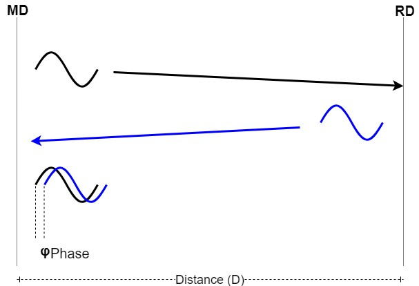

# RTP estimation fundamentals

The round-trip phase (previously known as PDE) is a technique that utilizes the phase difference between an MD (which is the initiator) and determines the need to estimate distance and an active RD to determine the distance between them.

In its simplest form, the MD transmits a continuous wave to the RD, which synchronizes its phase and sends the signal back to the MD. The MD then compares the phase of the received signal with the phase of the signal it transmitted, obtaining a phase difference.

**Phase difference using an MD and an RD**



With this information, the distance can be measured using the following equation:

**Equation 11. Measure distance using a single-phase difference**


Where:
-   φ is the phase difference, as measured by MD.
-   c is the speed of light.
-   f is the carrier frequency.
-   n is the number of wraps.

Note that the number of wraps (n) depends on the wavelength of the carrier frequency.

**Equation 12. Wavelength of the carrier frequency**


If the distance to measure is larger than λ, the phase wraps (creating a distance ambiguity) and the number of wraps (n) must be accounted for.

A sweep of multiple frequencies is used to reduce the above-mentioned ambiguity and to aid in analyzing multipath scenarios. If the phase difference is obtained at two different frequencies and the equations are combined, the following equation can be used to determine the distance:

**Equation 13. Distance estimation using two frequencies**


```{include} ../topics/slope_based_pde.md
:heading-offset: 1
```

```{include} ../topics/cde.md
:heading-offset: 1
```

```{include} ../topics/pde.md
:heading-offset: 1
```
