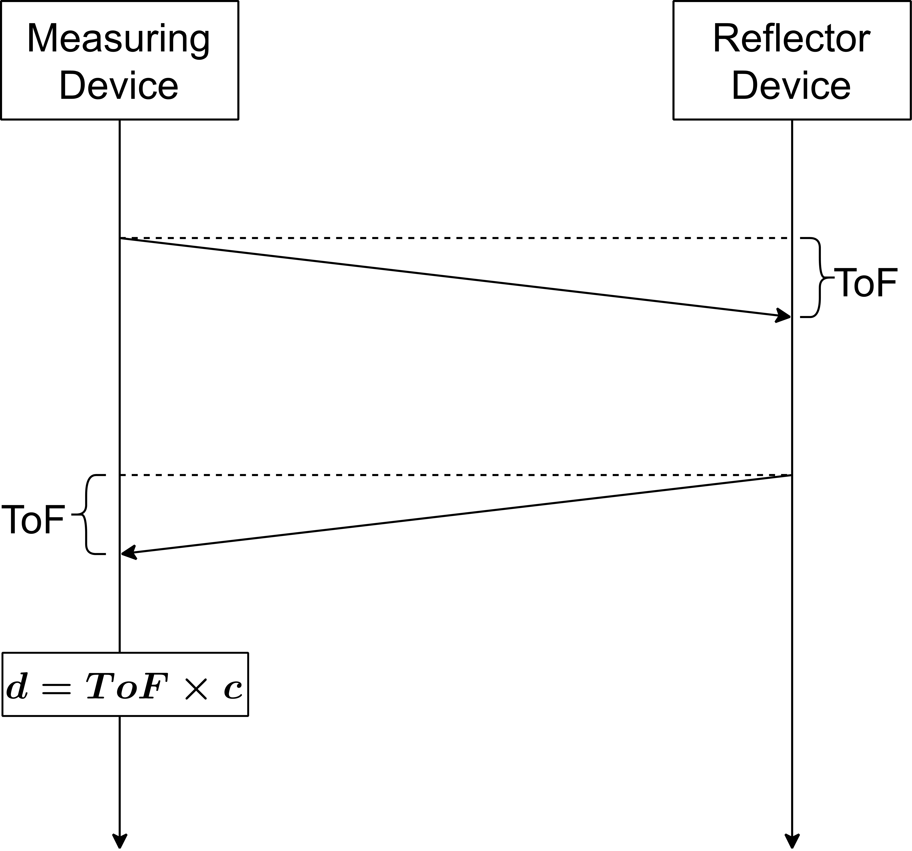
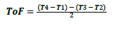
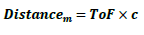
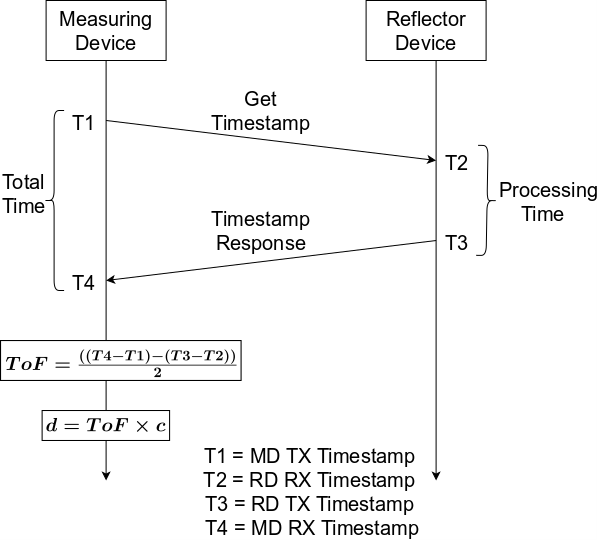

# RTT estimation fundamentals

The round-trip time (previously known as the time of flight) is a method to measuring the distance between a sensor and an object, based on a precise measurement of the time difference between the transmission of a signal by the sensor and its return to the sensor after being reflected by an object. This approach is part of the RTT measurement. Wireless ToF applies the same concept to two wireless devices that can perform distance measurement between them by exchanging packets and accounting for radio latencies and turn-around time overheads.

The narrowband ToF requires at least two devices with NBW radio support to exchange packets over the air. As shown in [Figure 13](../images/fig13.png "Basic ToF sequence"), it is based on a record of times at which the initial packet was transmitted by the MD and the time at which a response packet is received from the RD by the MD. The MD can calculate a ToF of the packet exchange. Using the calculated ToF, a distance estimate (or range) between the two devices can be computed. The determined distance (d) can be employed for a variety of functions, such as taking a specified action when the distance is above or below a threshold.

**Basic ToF sequence**


As shown in [Figure 13](../images/fig13.png "Basic ToF sequence"), a method to capture the timestamps at which the packets are transmitted and received is required at both ends. Furthermore, these timestamps must be shared from RD to MD for the ToF calculation. The MD records a count from a timer (designated T1) in response to initiating transmission of the ranging packet. In response to receiving the ranging packet, the RD records a count from a local timer (designated T2). The RD takes a certain amount of time to process the incoming packet and send a response packet. This time is designated as "Processing Time", which is an overhead that must be eliminated to get an accurate ToF reading. In response to initiating the transmission of the response packet, the RD stores the count (designated T3). The response packet includes a data payload indicating the timestamps to calculate the RD processing time. Upon receiving the response packet, the MD records the count (designated T4). With these timestamps, a ToF value can be generated according to [Equation 1.](../images/eq1.png "Calculation of ToF").

**Calculation of ToF**



Once the ToF value is calculated, the distance can be estimated using [Equation 2.](../images/eq2.png "Distance estimation using ToF").

**Distance estimation using ToF**



[Figure 14](../images/fig14.png "ToF calculation using timestamps") shows the sequence of packet exchange and timestamp collection for a single measurement.

**ToF calculation using timestamps**




```{include} ../topics/nb_tof.md
:heading-offset: 1
```
