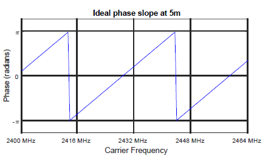
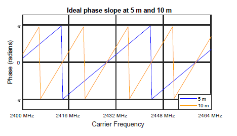

# Slope-based PDE

If a frequency sweep is done at a fixed distance and with constant spacing between the frequencies (Δf), the phases obtained at each frequency in the sweep produce a slope.

**Phase slope at 5 m**

There is a linear relationship between the phase slope observed and the distance to the object. The smaller the slope, the shorter the distance between RD and MD.

**Phase slope difference at 5 m and 10 m**

Using this slope, the equivalent distance can be obtained using the following equation:

**Equation 14. Distance obtained from phase slope**

To get the slope-based distance using phase differences obtained at several frequencies, [Equation 13](../images/eq13.png "Distance estimation using two frequencies") must be applied multiple times, as shown in the following equation:

**Equation 15. Immediate distance from a single-phase difference**

The final distance estimate can be obtained as follows:

**Equation 16. Distance obtained from the average of immediate distances**

The maximum measurable distance depends on the spacing between the measurement frequencies (Δf) and it is given by the following equation:

**Equation 17. Maximum distance measurable using the slope method**

**Parent topic:**[RTT estimation fundamentals](../topics/rtp_estimation_fundamentals.md)
