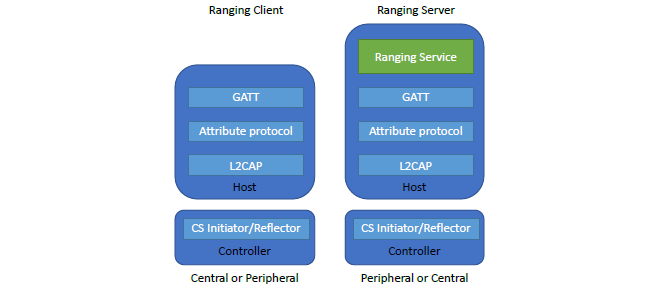

# Software layers architecture description

To enable the CS feature between 2 Bluetooth devices, a general service is proposed. In this service, the client and server roles are defined.
Typically, the client role in the service is the CS initiator and the server role is the CS reflector. However, there is also a scenario, where the client role is the CS reflector and the server role is the CS initiator. The complete list of scenarios is shown in Table 1.

Table 1. Scenarios for ranging server and ranging client

|             | Scenario I  |   |Scenario II |   |
| ----------- | ----------- | ----------- | ----------- |----------- |
| Host        | Ranging Client | Ranging Server | Ranging Client | Ranging Server |
| Controller  | Initiator | Reflector | Initiator | Reflector |

The Ranging Server (RAS) and Ranging Profile (RAP) enable the CS configuration parameters and CS results transport toward the Distance Measurement Application. The complete exchange of unmodulated carrier signals and/or packets is controlled by lower Bluetooth protocol layers (Bluetooth controller).

**The high-level SW architecture of the ranging server and ranging client**

The ranging client and ranging server must exchange their capabilities via the RAS capabilities characteristic. The ranging client writes (or reads) the configuration to the Ranging Server through the RAS configuration characteristic. Then, the 2 controllers start the ranging procedure. Once the ranging results are received by the RAS from the controller, the results will be exchanged using GATT toward the Distance Measurement Application. Some implementations may optionally use the enhanced attribute protocol to make notifications more reliable.
The roles defined in the ranging service and profiles are as follows:

-   Ranging client: the device in this role supports the GATT client role and optionally the enhanced attribute protocol and the CS initiator or reflector roles The ranging client can have either the central or peripheral roles. The ranging client has a direct interconnection with the Distance Measurement Application.

-   Ranging server: the device in this role supports the ranging service and profile. It implements the GATT server role and optionally the enhanced attribute protocol role. In the controller, it implements the CS reflector or initiator roles. The ranging server has either the central role or the peripheral role. The ranging server assists the ranging client by sending the local device capability, receiving the ranging client configurations, and sending the ranging result toward the ranging client.

The Distance Measurement Application will be implemented in the device that supports the ranging client. The hosts may support both the ranging client and ranging server implementations. The higher layer will choose which device runs the distance application and becomes the ranging client. [Figure 1](../images/fig1.png "The high-level SW architecture of the ranging server and ranging client") illustrates the high-level architecture of the ranging server and ranging client for 2 scenarios listed in Table 1. In the asset-tracking and indoor-positioning applications, the distance measurement application may calculate the distance between:

-   A ranging client and more than one ranging server
-   A ranging server and more than one ranging client

The CS standard (the part of the ranging server and ranging profile) also mentions examples of the typical application use cases. Table 2 shows several typical localization applications.

Table 2. Localization user scenario examples

| User Scenario | Ranging Client  | Ranging Server |
| ----------- | ----------- | ----------- |
| Vehicle access | Vehicle Bluetooth LE lock (single Bluetooth LE initiator, an initiator with multiple antennas, or multiple initiators each with a single antenna or multiple antennas)   |  Vehicle key (can be a phone) |
| Door access | Door Bluetooth LE lock | Door key (can be a phone) |
| Locate lamps, sensors, and actuators during commissioning or maintenance  | Handhold commissioner | Other lamps/sensors |
| Locate items with a smartphone | Bluetooth LE localization system (1 initiator or multiple initiators) | Tags |
| Locate items with a handheld locator device | Handhold with Bluetooth LE | Tags |
| F: Automatically map mesh nodes  | Some/all lamps must support dual roles (initiator and reflector devices) | Some/all lamps must support dual roles (initiator and target devices) |
| G: Cooktop control | Cooktop | Smartphone |
| H: Cooktop safety  | Cooktop | Smartphone |

**Note:**  The CS standard itself is not responsible for computing the distance measurement

**Parent topic:**[The channel sounding standard description](../topics/cs_standard_description.md)
