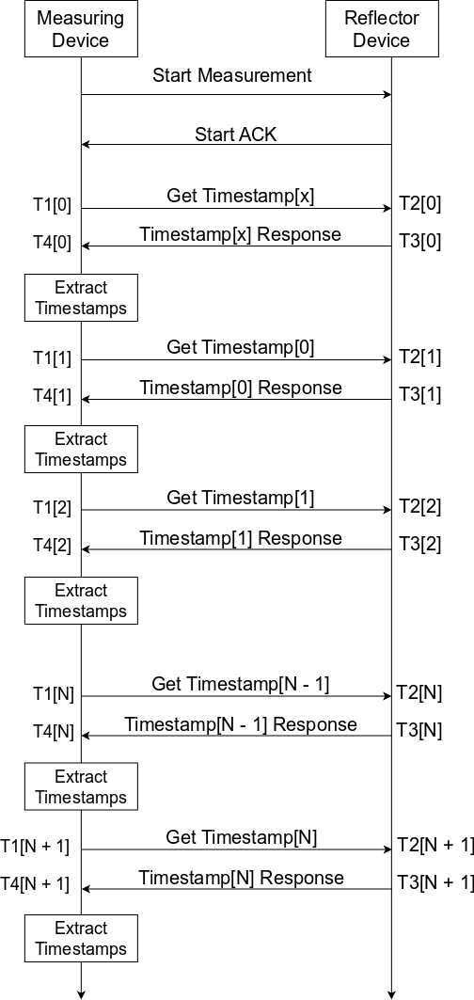

# Timestamp collection

During this stage, the devices perform a series of packet exchanges. Each exchange creates a set of timestamps T1 – T4, which are made available to the MD for analysis. As T2 and T3 are generated at RD, they shall be shared on the response packet along with other information that might be useful, such as RSSI. As T3 (RD TX Timestamp) is generated by a transmission of the response packet, a causal implementation is possible by having the RD response to the MD contain timestamps corresponding to the previous packet exchange, as shown in [Figure 17](../images/fig17.png "Timestamping collection").

Wireless communication, especially in the shared Industrial, Scientific, and Medical (ISM) frequency band can be hampered by interference due to proximity of other radios utilizing the same frequency band and/or multi-path propagation artifacts. Using multiple carrier frequencies for ToF can reduce the impact of such artifacts and increases the likelihood of a successful ToF measurement. As explained in this document, a ToF distance measurement typically comprises of exchanging a set of packets for physical ToF measurements (by timestamping) as well as control communication between the two wireless nodes. Due to interference and artifacts, any of the packets containing either the timestamp requests, timestamped measurements, or measurement command packets might fail to arrive in either direction. For robust operation, a ToF measurement system should incorporate a robust mechanism that can recover from such events. Such a mechanism must be intelligent enough to identify and skip specific carrier frequencies if they have persistent interference and continue with the measurement on a different frequency, rather than just abort due to the missed packets.

**Timestamping collection**

**Parent topic:**[Narrowband ToF](../topics/nb_tof.md)
