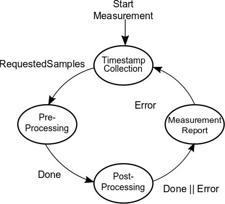

# Multi-stage ToF

The ToF measurement consists of four stages: timestamp collection, preprocessing, postprocessing, and measurement report

**ToF stages**



```{include} ../topics/timestamp_collection.md
:heading-offset: 1
```

```{include} ../topics/preprocessing.md
:heading-offset: 1
```

```{include} ../topics/postprocessing.md
:heading-offset: 1
```

```{include} ../topics/0_dst_calibration.md
:heading-offset: 1
```

**Parent topic:**[Narrowband ToF](../topics/nb_tof.md)
