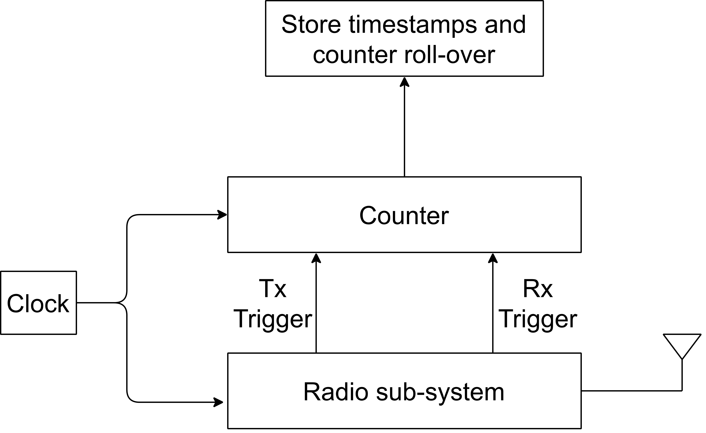

# Timestamping mechanism

A precise timestamping mechanism is required on both ends for the NBW ToF to achieve the targeted accuracy. At the system level, this not only imposes requirements on the stability and relative accuracy of the timestamping clocks used by both MD and RD, it is also desired that the timestamp-capture mechanism does not contribute to additional jitter. This requirement typically implies that timestamping must be hardware-based and utilize precise triggers for both packet transmission and reception.

To generate precise timestamps, a deterministic and accurate counter is required. For instance, a 16-bit MCU timer, clocked by the radio’s reference clock, can be chosen. Given the counter-clock frequency and its size, the count overflows and roll-overs happen every few milliseconds, which must be accounted for as well.
The timestamp trigger should be generated from the radio SoC to ensure a stable trigger at specific anchors of the packets. For instance, the transmission timestamp source could be taken from a signal asserted when the system is ready to transmit the first preamble bit. On the receiving end, a packet-reception trigger source can happen when the radio detects the synchronization delimiter (such as the access address in Bluetooth LE or Start-of-Frame Delimiter (SFD) for IEEE 802.15.4) arrival for the packet. [Figure 15](../images/fig15.png "Timestamp block diagram") shows the timestamp block diagram.

**Timestamp block diagram**

**Parent topic:**[Narrowband ToF](../topics/nb_tof.md)
