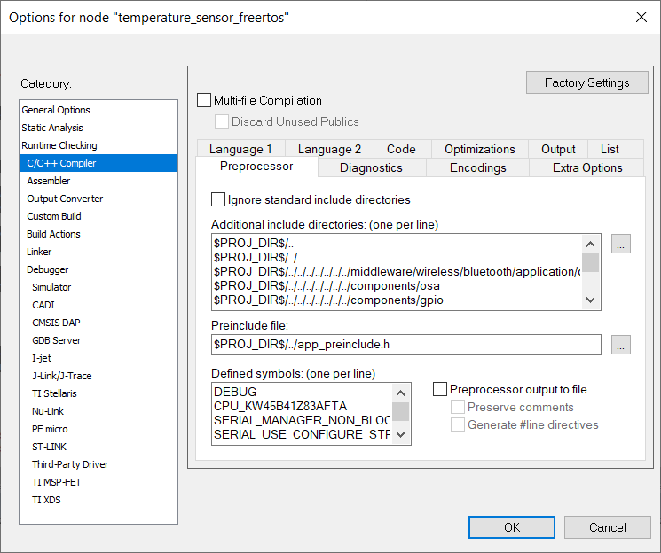

# Application code

The application folder contains the following modules:

-   *app.c* and *app.h*. This module stores the application-specific functionality \(APIs for specific triggers, handling of peripherals, callbacks from the stack, handling of low power, and so on\).

Before initializing the Bluetooth LE Host Stack, the start task calls *BluetoothLEHost\_AppInit*. This function initializes application specific functionality before initializing the Bluetooth LE Host Stack by calling *BluetoothLEHost\_Init*.

After the stack is initialized, the *BluetoothLEHost\_Initialized* callback is called. The function contains configurations made to the Bluetooth LE Host Stack after the initialization. This includes registering callbacks, setting security for services, starting services, allocating timers, adding devices to the Filter Accept List, and so on. For example, the Temperature Sensor configures the following:

```
static void BluetoothLEHost_Initialized(void)
{
  /* Common GAP configuration */
    BleConnManager_GapCommonConfig();

  /* Register for callbacks*/
    (void)App_RegisterGattServerCallback(BleApp_GattServerCallback);

    mAdvState.advOn = FALSE;

  /* Start services */
    SENSORS_TriggerTemperatureMeasurement();
    (void)SENSORS_RefreshTemperatureValue();
    /* Multiply temperature value by 10. SENSORS_GetTemperature() reports temperature
    value in tenths of degrees Celsius. Temperature characteristic value is degrees
    Celsius with a resolution of 0.01 degrees Celsius (GATT Specification
    Supplement v6). */
    tmsServiceConfig.initialTemperature = (int16_t)(10 * SENSORS_GetTemperature());
    (void)Tms_Start(&tmsServiceConfig);

    basServiceConfig.batteryLevel = SENSORS_GetBatteryLevel();
    (void)Bas_Start(&basServiceConfig);
    (void)Dis_Start(&disServiceConfig);

  /* Allocate application timer */
    (void)TM_Open(appTimerId);

    AppPrintString("\r\nTemperature sensor -> Press switch to start advertising.\r\n");
}
```

To start the application functionality, `BleApp_Start()` function is called. This function usually contains code to start advertising for sensor nodes or scanning for central devices. In the example of the Temperature Sensor, the function is the following:

```
static void BleApp_Start(void)
{
    Led1On();

    if (mPeerDeviceId == gInvalidDeviceId_c)
    {
      /* Device is not connected and not advertising */
        if (!mAdvState.advOn)
        {
           /* Set advertising parameters, advertising to start on gAdvertisingParametersSetupComplete_c */
           BleApp_Advertise();
        }
    }
    else
    {
        /* Device is connected, send temperature value */
        BleApp_SendTemperature();
    }
}
```

-   *app\_config.c.* This file contains data structures that are used to configure the stack.

This includes advertising data, scanning data, connection parameters, advertising parameters, SMP keys, security requirements, and so on.

-   *app\_preinclude.h*.

This header file contains macros to override the default configuration of any module in the application. It is added as a preinclude file in the preprocessor command line in IAR, as shown in [Figure](../images/figure_16_new_preprocessor.png):



-   *gatt\_db.h* and *gatt\_uuid128.h*. The two header files contain the definition of the GATT database and the custom UUIDs used by the application. See [Creating GATT database](creating_gatt_database.md#) for more information.

**Parent topic:**[Profile configuration](../topics/profile_configuration.md)

