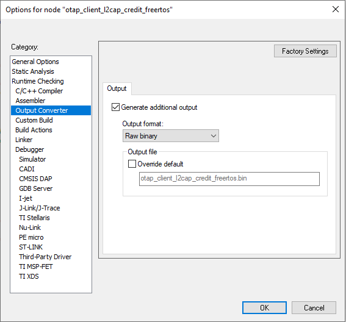
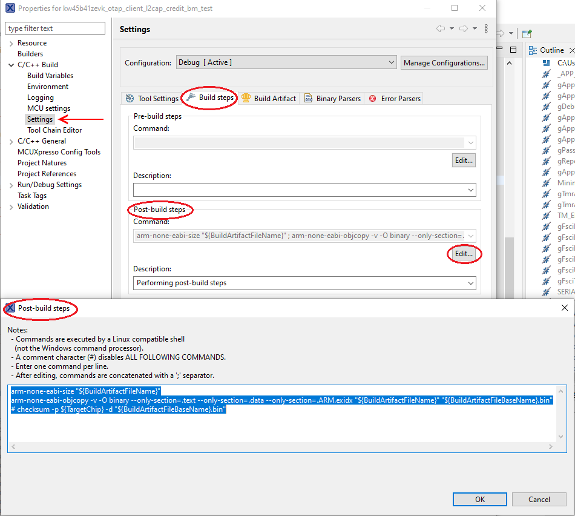

# Building Bluetooth Low Energy OTAP image file from BIN file

A BIN file is an binary file which contains an executable image. The most common extension for this type of file is `.bin`. Most modern compiler toolchains can output a BIN format executable.

To enable the creation of a BIN file for your embedded application in IAR Embedded Workbench open the target properties and go to the *Output Converter* tab. Activate the *“Generate additional output”* checkbox and choose the *binary* option from the *“Output format”* drop down menu. From the same pane you can also override the name of the output file. The [Figure](../images/fig21new.PNG) shows a screenshot of the described configuration.



In MCUXpresso IDE, go to **Project properties** -\> **Settings** -\> **Build steps** window and press the "**Edit**" button for the Post-build steps. A Post-build steps window shows up in which the following command must be added:

```
arm-none-eabi-objcopy -v -O binary --only-section=.text --only-section=.data --only-section=.ARM.exidx 
   "${BuildArtifactFileName}"
   "${BuildArtifactFileBaseName}.bin"
```

The [Figure](../images/fig22new.png) below shows the Build steps and Post-build steps in **Settings** window.



The format of the BIN file is very simple. It contains the executable image in binary format as is, starting from address 0 and up to the highest address. This type of file does not have any explicit address information.

To build an OTAP Image File from a BIN file, follow the procedure below:

-   Generate the BIN file by correctly configuring your toolchain to do so.
-   Create the image file header
    -   Set the `Image ID` field of the header to be unique on the OTAP Server.
    -   Leave the `Total Image File Size` field blank for the moment.
-   Create the Upgrade Image Sub-element
    -   Copy the entire contents of the BIN file as is into the *Value* filed of the sub-element.
    -   Fill in the *Length* field of the sub-element with the length of the written *Value* filed.
-   Create the Sector Bitmap Sub-element
    -   A default working setting would be all bytes `0xFF` for the *Value* field of this sub-element.
-   Create the Image File CRC Sub-element
    -   Compute the total image file size as the length of the header + the length of all 3 sub-elements and fill in the appropriate filed in the header with this value.
    -   Compute and write the *Value*field of this sub-element using the header and all sub-elements except this one.
    -   The *OTA\_CrcCompute\(\)* function in the *OtaSupport.c* file can be used to incrementally compute the CRC.

If the Image ID is not available when the image file is created, then the CRC cannot be computed. It can be computed later after the Image ID is established and written in the appropriate field in the header.

**Parent topic:**[Over the Air Programming \(OTAP\)](../topics/over_the_air_programming_otap.md)

