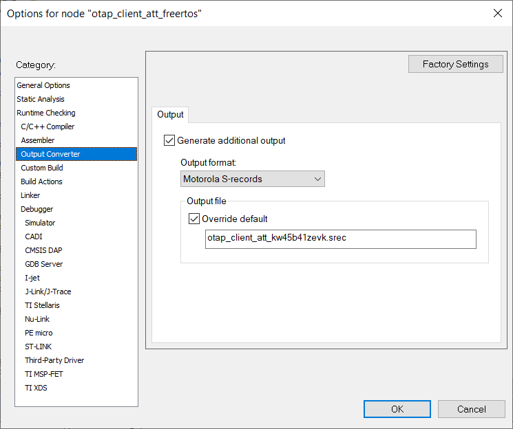

# Building Bluetooth Low Energy OTAP image file from SREC file

A SREC \(Motorola S-record\) file is an ASCII format file which contains binary information. Common file extensions are: `.srec`, `.s19`, `.s28`, `.s37` and others. Most modern compiler toolchains can generate an SREC format executable.

The steps described in this section enable the creation of a SREC file for your embedded application in IAR Embedded Workbench.

For this, open the target properties and go to the **Output Converter** tab. Activate the **Generate additional output** checkbox and choose the **Motorola** option from the **Output format** drop down menu. From the same pane you can also override the name of the output file. A screenshot of the described configuration is shown in the [Figure](../images/figure_19_new_srec.png) below.



The format of the SREC file is shown in table below. It contains lines of text called records which have a specific format. An example of the contents of a SREC file is shown below.

```

                S02000006F7461705F636C69656E745F6174745F4672656552544F532E73726563A1
                S1130000F83F0020EB0500007506000075060000AF
                S113001075060000750600007506000075060000F0
                S113002075060000750600007506000075060000E0
                S113003075060000750600007506000075060000D0
                S113004000000000000000000000000000000000AC
                S1130050000000000000000000000000000000009C
                .............
                S2140117900121380004F05FF8002866D12A003100E4
                S2140117A06846008804F022F8A689002E16D0002884
                S2140117B014D12569278801A868A11022F7F782FCB1
                S2140117C06B4601AA0121380004F045F800284CD1E7
                S2140117D02A0031006846008804F008F8A68A002E20
```

All records start with the ASCII letter ‘S’ followed by an ASCII digit from ‘0’ to ‘9’. These two characters from the record type identify the format of the data field of the record.

The next 2 ASCII characters are 2 hex digits that indicate the number of bytes \(hex digit pairs\) which follow the rest of the record \(address, data, and checksum\).

The address that follows next can have 4, 6, or 8 ASCII hex digits, depending on the record type.

The data field is placed after the address and it contains 2 \* n ASCII hex digits for 'n' bytes of actual data.

The last element of the S record is the checksum, which comprises 2 ASCII hex digits. The checksum is computed by adding all the bytes of the byte count, address, and data fields. Then the ones complement of the least significant octet of the sum is computed to determine the checksum.

| Field  | Record Type | Count | Address |Data | Checksum | Line Terminator |
| -----  | ----------- | ----- | ------- |---- | -------- | --------------- |
| Format | “Sn”, n=0..9| ASCII<br>hex digits | ASCII<br>hex digits | ASCII<br>hex digits | ASCII<br>hex digits |“\\r\\n” |
|Length \(characters\)|2|2|4,6,8|*Count –*len*\(Address\) –*len\(*Checksum\)*|2|2|

More details about the SREC file format can be found at this location: [en.wikipedia.org/wiki/SREC\_\(file\_format\)](https://en.wikipedia.org/wiki/SREC_%28file_format%29).

We are only interested in records that contain actual data. These are S1, S2, and S3 records. The other types of records can be ignored.

The S1, S2, and S3 records are used to build the Upgrade Image Sub-element of the image file simply by placing the record data at the location specified by the record address in the *Value* field of the Sub-element. It is recommended to fill all gaps in S record addresses with 0xFF.

To build an OTAP Image File from a SREC file, follow the procedure described below:

-   Generate the SREC file by correctly configuring your toolchain to do so.
-   Create the image file header.
    -   Set the Image ID field of the header to be unique on the OTAP Server.
    -   Leave the Total Image File Size Field blank for the moment.
-   Create the Upgrade Image Sub-element
    -   Read the S1, S2, and S3 records from the SREC file and place the binary record data to the record addresses in the *Value* filed of the sub-element. Fill all address gaps in the S records with 0xFF.
    -   Fill in the *Length* field of the sub-element with the length of the written *Value* field.
-   Create the Sector Bitmap Sub-element
    -   A default working setting would be all byes 0xFF for the *Value* field of this sub-element.
-   Create the Image File CRC Sub-element
    -   Compute the total image file size as the length of the header + the length of all 3 sub-elements and fill in the appropriate filed in the header with this value.
    -   Compute and write the *Value*field of this sub-element using the header and all sub-elements except this one.
    -   The *OTA\_CrcCompute\(\)* function in the *OtaSupport.c* file can be used to incrementally compute the CRC.

If the Image ID is not available when the image file is created, then the CRC cannot be computed. It can be computed later after the Image ID is established and written in the appropriate field in the header.

**Parent topic:**[Over the Air Programming \(OTAP\)](../topics/over_the_air_programming_otap.md)

