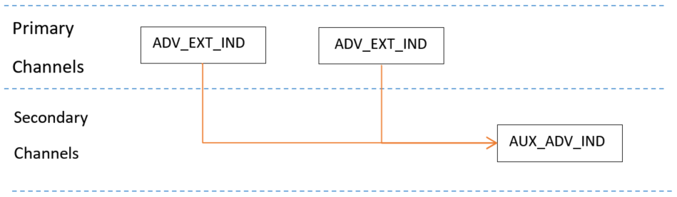
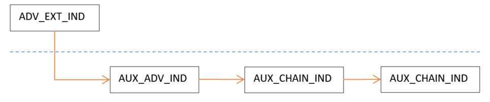

# Extended advertising

Starting with Bluetooth 5, the advertising channels are separated in primary advertising channels and secondary advertising channels:

1.  Primary advertising channels
    -   Use 3 legacy advertising channels 37, 38, and 39.
    -   Can use either legacy 1M PHY or new LE Coded PHY.
    -   PHY payload can vary from 6 to 37 bytes.
    -   Packets on these channels are part of the advertising events.
2.  Secondary advertising channels
    -   Use 37 channels, with the same channel index as the data channels.
    -   Can use any LE PHY, but the same PHY during an Extended Advertising Event.
    -   PHY payload can vary from 0 to 255 bytes.
    -   Auxiliary packets on these channels are part of the Extended Advertising Event that begins at the same time with the advertising event on primary channel and ends with the last packet on the secondary channel.<br>

    **Extended advertising** <br>
    

    **Extended advertising – Multiple chains** <br>
    


An advertising data set is represented by advertising PDUs belonging together in an advertising event. Each set has different advertising parameters: PDU type, advertising interval, and PHY mode. The advertising data sets are identified by the Advertising SID \(Set ID\) field from the ADI – Advertising Data Info. Advertising data or Scan response data can be changed for each adverting data set and the random value of DID \(Data ID\) field is updated to differentiate between them.

Refer to [Figure 1](../images/extended_advertising.png) and [Figure 2](../images/extendedadvertising_multiplechains.png).


```{include} ../topics/peripheral_setup_001.md
:heading-offset: 2
```

```{include} ../topics/central_setup.md
:heading-offset: 2
```

**Parent topic:**[Generic Access Profile \(GAP\) Layer](../topics/generic_access_profile_gap_layer.md)

