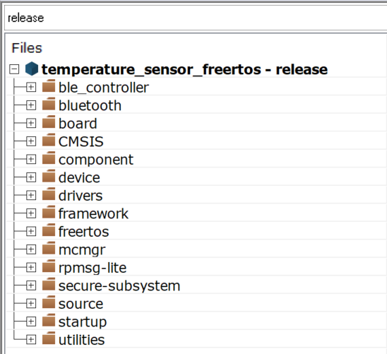
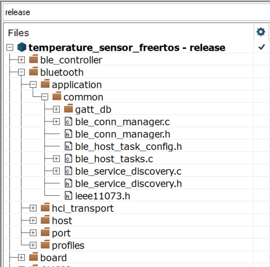
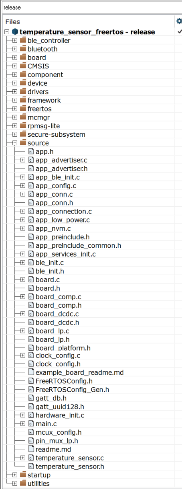
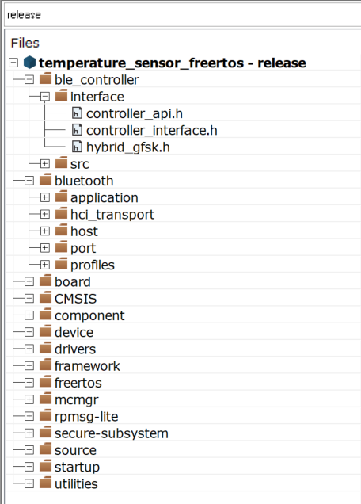

# Folder structure

The [Figure](../images/app_folder_structure.png) shows the application folder structure.  

**Application Folder structure in workspace**  

The *app* folder follows a specific structure which is recommended for any application developed using the Bluetooth Low Energy Host Stack:

-   The *common* group contains the application framework shared by all profiles and demo applications:
    -   Bluetooth Low Energy Connection Manager
    -   Bluetooth Service Discovery Manager
    -   Bluetooth Low Energy Stack and Task Initialization and Configuration
    -   GATT Database

**Common Group**  

-   The *source* group contains code specific to the Temperature Sensor application.

    In the following examples, *app.c* is used as a placeholder for the main application source file. In the case of Temperature Sensor, it is *temperature\_sensor.c*.

    The source group also contains files which aid with the handling of Host events and framework related functionality. These are: *app\_conn.c*/*app\_conn.h*, *app\_advertiser.c*, *app\_connection.c*, *app\_scanner.c*, *app\_nvm.c*, and *app\_low\_power.c*. These files do not allow the application to implement its own state machines, unless application-specific functionality is required. For example, the application is restricted from setting advertising parameters and starting advertising, unless certain application-specific functionalities, such as UI related updates are required.

**Source Group**  

The *bluetooth* folder/group contains:

-   The *host/interface*, and *host/config*. These are public interfaces and configuration files for the Host. The functionality is included in the library located in the *host/lib* subfolder. The folder is not shown in the IAR project structure, but added into the toolchain linker settings under the library category.
-   *bluetooth/profiles* contains profile-specific code; it is used by each demo application of standard profiles.

The *ble_controller* folder/group contains:

-   The *controller/interface*. These are public interfaces and configuration files for the Controller.

**Bluetooth and Controller Groups**  

The framework and component folders/groups contain framework components used by the demo applications. For additional information, see the *Connectivity Framework Reference Manual*.

The *freertos* folder contains sources for the supported operating system.

**Parent topic:**[Application Structure](../topics/application_structure.md)

