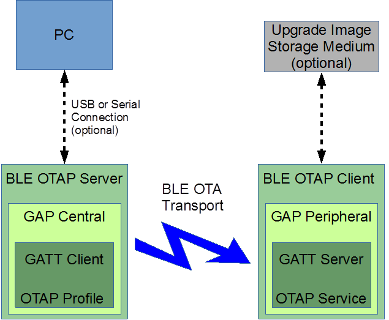

# General functionality

A Bluetooth Low Energy OTAP system consists of an OTAP Server and an OTAP Client which exchange an image file over the air using the infrastructure provided by Bluetooth Low Energy \(GAP, GATT, SM\) via a custom GATT Service and GATT Profile. Additionally, a third application may be used to serve an image to the embedded OTAP Server.

The OTAP Server runs on the GATT Client via the Bluetooth Low Energy OTAP Profile and the OTAP Client runs on the GATT Server via the Bluetooth Low Energy OTAP Service. For the moment the OTAP Server runs on the GAP Central and the OTAP Client runs on the GAP Peripheral.

The [Figure](../images/figure16.png) shows a typical image upgrade scenario.

**Parent topic:**[Over the Air Programming \(OTAP\)](../topics/over_the_air_programming_otap.md)

