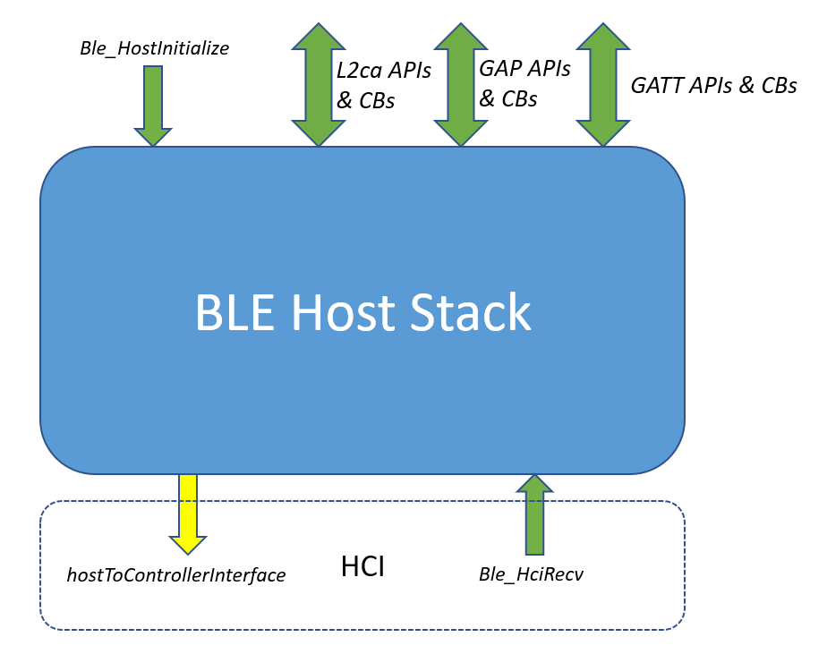

# Main function to initialize the Bluetooth LE Host Stack

This [Figure](../images/figure_1.png) provides an overview of Bluetooth Low Energy Host Stack. When using the existing application common files, the startup task uses *BluetoothLEHost\_AppInit\(\)*, which is defined in *app\_conn.h*. The function initializes all components related to the Bluetooth Low Energy application. It has the following prototype:

```
void BluetoothLEHost_AppInit(void);
```

The *BluetoothLEHost\_AppInit\(\)* function must be implemented by each application. It should register its generic event callback using *BluetoothLEHost\_SetGenericCallback\(\)* and initialize the Bluetooth LE Host Stack layer by calling *BluetoothLEHost\_Init\(\)*. The prototype for the *BluetoothLEHost\_Init\(\)* function is found in *app\_conn.h* and is implemented in *app\_conn.c*.

```
void BluetoothLEHost_Init
(
    appBluetoothLEInitCompleteCallback_t pCallback
);
```

*BluetoothLEHost\_Init* takes as parameter a function to be called at the end of Bluetooth LE Host Stack initialization. In this callback, the application can register its callbacks with the Host layer, allocate timers, start services, and perform similar tasks. The callback should have a prototype as follows:

```
static void BluetoothLEHost_Initialized(void);
```

*BluetoothLEHost\_Init\(\)* is responsible for initializing the Host.

Initialize the Bluetooth LE Host Stack after platform setup is complete and all RTOS tasks have been started. The function that should be called for this purpose is located in the *ble\_general.h* file and has the following prototype:

```
bleResult_t Ble_HostInitialize
(
    gapGenericCallback_t            genericCallback,
    hciHostToControllerInterface_t  hostToControllerInterface
);
```



**Parent topic:**[Bluetooth LE Host Stack Initialization and APIs](../topics/bluetooth_le_host_stack_initialization_and_apis.md)

