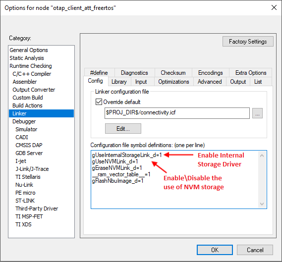
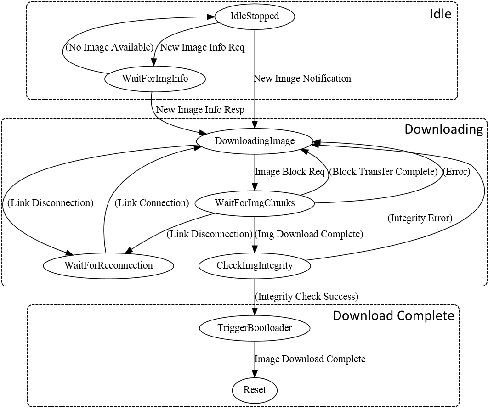

# OTAP client

An application running an OTAP Client must wait for an OTAP Server to connect and perform service and characteristic discovery before performing any OTAP-related operations. OTAP transactions can begin only after the OTAP Server writes the OTAP Control point CCC Descriptor to receive ATT Notifications. After this is done, bidirectional communication is established between the OTAP Server and Client and OTAP transactions can begin.

The OTAP Client can advertise the OTAP Service via the demo application. Optionally, the OTAP Server may already know the advertising device has an OTAP Service based on application-specific means. In both situations, the OTAP Server must discover the handles of the OTAP Service and its characteristics.

In addition to the OTAP Service instantiated in the GATT Database, the OTAP Client needs to have some storage capabilities for the downloaded image file.

How to put the OTAP Service in the GATT Database is described in [The OTAP Service and Characteristics](otap_service_and_characteristics.md#).

The upgrade image storage capabilities in the demo OTAP Client applications are handled by the *OtaSupport* module from the Framework, which contains support modules and drivers. The *OtaSupport* module has support for both internal storage \(a part of the internal flash memory is reserved for storing the upgrade image\) and external storage \(a SPI flash memory chip\).

The demo applications use internal storage by default. The internal storage is viable only if there is enough space in the internal flash for the upgrade image – the flash in this case should be at least twice the size of the largest application. The *OtaSupport* module also needs the *Eeprom* module from the Framework to work correctly.

The OtaSupport module also includes functionality for configuring the OTACFG IFR sections after the image is received in order to enable the ROM bootloader to perform the actual image update.

To use the *OtaSupport* module several configuration options must be set up in both the source files and the linker options of the toolchain.

To use internal storage, set up the `gUseInternalStorageLink_d=1` symbol in the linker configuration window \(**Linker-\>Config tab** in the IAR project properties\) and set the `gAppOtaExternalStorage_c value` to \(`0`\) in the `app_preinclude.h`file:

```
/*! Define as 1 to place OTA storage in external flash */
  #define gAppOtaExternalStorage_c (0)
```

The OTAP demo applications for the IAR EW IDE have some settings in the Linker options tab which must be configured to use OtaSupport and the OTAP Bootloader. In the **Project Target Options**-\>**Linker**-\>**Config** tab, 3 symbols must be correctly defined. To use NVM storage, the`gUseNVMLink_d` symbol must be set to `1`. The `gUseInternalStorageLink_d` symbol must be set to `0` when OTAP external storage is used and to `1`when the internal storage is used. The `gEraseNVMLink_d` must be set to 0.

An example linker configuration window for IAR is shown below.



**Note:** The gEraseNVMLink\_d=1 IAR linker flag places some dummy bytes into the NVM region to invalidate the data and force the application to erase the entire NVM region. When generating an image for the OTA upgrade, this flag must be set to 0. This results in a smaller image size being transferred and lower power consumption. If the NVM region must be erased after the upgrade process, the "Preserve NVM" checkbox \(from the Over The Air programming tool\) should be unchecked.

Once the application starts and bidirectional OTAP communication is established via the OTAP Service, then the OTAP Client must determine if the connected OTAP Server has a newer image than the one currently present on the device. This can be done in two ways:

-   The OTAP Server knows by some application-specific means that it has a newer image and sends a New Image Notification to the OTAP Client or
-   The OTAP Client sends a New Image Info Request to the OTAP Server and waits for a response. This example application uses the second method.

The New Image Info Request contains enough information about the currently running image to allow the OTAP Server to determine if it has a newer image for the requesting device. The New Image Info Response contains enough information for the OTAP Client to determine if the "deadvertised” image is newer and it wants to download it. The best method is entirely dependent on application requirements.

An example function that checks if an *ImageVerison* field from a New Image Notification or a New Image Info Response corresponds to a newer image \(based on the suggested format of this field\) is provided in the OTAP Client demo applications. The function is called *OtapClient\_IsRemoteImageNewer\(\)*.

The OTAP Client application is a little more complicated than the OTAP Server application because more state information needs to be handled \(current image position, current chunk sequence number, image file parsing information, and so on\). An example state diagram for the OTAP Client is shown below. The [Figure](../images/figure23.png) briefly lists the steps of the image download process. Note that some of the states may not be explicitly present in the demo applications.



After the OTAP Client determines that the peer OTAP Server has a suitable upgrade image available, it can start the download process. This is done by sending multiple Image Block Request messages and waiting for the Image Chunks via the selected transfer method.

While receiving the image file blocks, the OTAP Client application parses the image file. In case any parameter of an image file sub-element is invalid or the image file format is invalid, it sends an Error Notification to the OTAP Server and tries to restart the download process from the beginning or a known good position.

When an Image Chunk is received, its sequence number is checked and its content is parsed in the context of the image file format. If the sequence number is not as expected, then the block transfer is restarted from the last known good position. When all chunks of an Image Block are received, the next block is requested, if there are more blocks to download. When the last Image Block in an image file is received, then the image integrity is checked \(the received CRC from the Image File CRC sub-element is compared to the computed CRC\).

The computed image integrity initialization and intermediary value must be reset to '`0`' before starting or restarting an image download. If the image integrity check fails then the image download process is restarted from the beginning. If the image integrity check is successful, then the `Image Download Complete` message is sent to the OTAP Server, the OTACFG IFR is updated and the MCU is restarted. After the restart, the ROM bootloader kicks in and writes the new image to the flash memory, afterwards giving CPU control to the newly installed application.

If at any time during the download process, a Link Layer disconnection occurs, then the image download process is restarted from the last known good position when the link is re-established.

As noted earlier, the OTAP Client application needs to handle a lot of state information. In the demo application, all this information is held in the *otapClientData* structure of the *otapClientAppData\_t* type. The type is defined and the structure is initialized in the *otap\_client.c* file of the application. This structure is defined and initialized differently for the OTAP Client ATT and L2CAP example applications. Mainly, the *transferMethod* member of the structure is constant and has different values for the two example applications and the L2CAP application structure has an extra member.

To receive write notifications when the OTAP Server writes the OTAP Control Point attribute and ATT Confirmations when it indicates the OTAP Control Point attribute, the OTAP Client application must register a GATT Server callback and enable write notifications for the OTAP Control Point attribute. This is done in the *BluetoothLEHost\_Initialized\(\)* function in the *otap\_client\_att.c/otap\_client\_l2cap\_credit.c* file.

```
static void BluetoothLEHost_Initialized(void)
{
    /* ... Missing code here ... */

    /* Register stack callbacks */
    (void)App_RegisterGattServerCallback (BleApp_GattServerCallback);

    /* ... Missing code here ... */
}
```

The *BleApp\_GattServerCallback\(\)* function handles all incoming communication from the OTAP Server.

```
static void BleApp_GattServerCallback (deviceId_t deviceId, gattServerEvent_t* pServerEvent)
{
    switch (pServerEvent->eventType)
    {
        /* ... Missing code here ... */
        
        case gEvtCharacteristicCccdWritten_c:
        {
            OtapClient_CccdWritten (deviceId,
                                pServerEvent->eventData.charCccdWrittenEvent.handle,
                                pServerEvent->eventData.charCccdWrittenEvent.newCccd);
        }
        break;

       case gEvtAttributeWritten_c:
        {
            OtapClient_AttributeWritten (deviceId,
                                     pServerEvent->eventData.attributeWrittenEvent.handle,
                                     pServerEvent->eventData.attributeWrittenEvent.cValueLength,
                                     pServerEvent->eventData.attributeWrittenEvent.aValue);
        }
       break;

        case gEvtAttributeWrittenWithoutResponse_c:
        {
            OtapClient_AttributeWrittenWithoutResponse (deviceId,
                                                    pServerEvent->eventData.attributeWrittenEvent.handle,
                                                    pServerEvent->eventData.attributeWrittenEvent.cValueLength,
                                                    pServerEvent->eventData.attributeWrittenEvent.aValue);
        }
        break;

        case gEvtHandleValueConfirmation_c:
        {
            OtapClient_HandleValueConfirmation (deviceId);
        }
       break;*

        /* ... Missing code here ... */
        
        default:
            ; /* For MISRA compliance */
        break;
    }
}
```

When the OTAP Server Writes a CCCD the *BleApp\_GattServerCallback\(\)* function calls the *OtapClient\_CccdWritten\(\)* function which sends a New Image Info Request when the OTAP Control Point CCCD is written it – this is the starting point of OTAP transactions in the demo applications.

When an ATT Write Request is made by the OTAP Server the the *BleApp\_GattServerCallback\(\)* function calls the *OtapClient\_AttributeWritten\(\)* function which handles the data as an OTAP command. Only writes to the OTAP Control Point are handled as OTAP commands. For each command received from the OTAP Server there is a separate handler function which performs required OTAP operations. These are:

-   *OtapClient\_HandleNewImageNotification\(\)*
-   *OtapClient\_HandleNewImageInfoResponse\(\)*
-   *OtapClient\_HandleErrorNotification\(\)*

When an ATT Write Command \(GATT Write Without Response\) is sent by the OTAP Server the *BleApp\_GattServerCallback\(\)* function calls the *OtapClient\_AttributeWrittenWithoutResponse\(\)* function which handles Data Chunks if the selected transfer method is ATT and returns an error if any problems are encountered. Data chunks are handled by the *OtapClient\_HandleDataChunk\(\)* function.

```
static void BleApp_AttributeWrittenWithoutResponse (deviceId_t deviceId,
                                                                     uint16_t handle,
                                                                     uint16_t length,
                                                                     uint8_t* pValue)
{
    /* ... Missing code here ... */
    f (handle == value_otap_data)
    {
        /* ... Missing code here ... */
        if (otapClientData.transferMethod == gOtapTransferMethodAtt_c)
        {
            if (((otapCommand_t*)pValue)->cmdId == gOtapCmdIdImageChunk_c)
            {
                OtapClient_HandleDataChunk (deviceId,
                                            length,
                                            pValue);
            }
        }
        /* ... Missing code here ... */
    }
    /* ... Missing code here ... */
}
```

Finally, when an ATT Confirmation is received for a previously sent ATT Indication the *BleApp\_GattServerCallback\(\)* function calls the *OtapClient\_HandleValueConfirmation\(\)* function, which performs the necessary OTAP operations based on the last sent command to the OTAP Server. This is done using separate confirmation handling functions for each command that is sent to the OTAP Server. These functions are:

-   *OtapClient\_HandleNewImageInfoRequestConfirmation\(\)*
-   *OtapClient\_HandleImageBlockRequestConfirmation\(\)*
-   *OtapClient\_HandleImageTransferCompleteConfirmation\(\)*
-   *OtapClient\_HandleErrorNotificationConfirmation\(\)*
-   *OtapClient\_HandleStopImageTransferConfirmation\(\)*

Outgoing communication from the OTAP Client to the OTAP Server is done using the *OtapCS\_SendCommandToOtapServer\(\)* function. This function writes the value to be indicated to the OTAP Control Point attribute in the GATT database and then calls the *OtapCS\_SendControlPointIndication\(\)*which checks if indications are enabled for the target device and sends the actual ATT Indication. Both functions are implemented in the *otap\_service.c* file.

```
bleResult_t OtapCS_SendCommandToOtapServer (uint16_t serviceHandle,
                                            void* pCommand,
                                            uint16_t cmdLength)
{
    union
    {
        uint8_t*                uuid_char_otap_control_pointTemp;
        bleUuid_t*              bleUuidTemp;
    }bleUuidVars;

    uint16_t  handle;
    bleResult_t result;
    bleUuidVars.uuid_char_otap_control_pointTemp = uuid_char_otap_control_point;
    bleUuid_t* pUuid = bleUuidVars.bleUuidTemp;

    /* Get handle of OTAP Control Point characteristic */
    result = GattDb_FindCharValueHandleInService(serviceHandle,
                                                 gBleUuidType128_c, pUuid, &handle);

    if (result == gBleSuccess_c)
    {
        /* Write characteristic value */
        result = GattDb_WriteAttribute(handle,
                                       cmdLength,
                                       (uint8_t*)pCommand);

       if (result == gBleSuccess_c)
        {
            /* Send Command to the OTAP Server via ATT Indication */
            result = OtapCS_SendControlPointIndication (handle);
        }
    }

   return result;
}

static bleResult_t OtapCS_SendControlPointIndication (uint16_t handle)
{
    uint16_t     hCccd;
    bool_t       isIndicationActive;
    /* Get handle of CCCD */
    GattDb_FindCccdHandleForCharValueHandle (handle, &hCccd);
    Gap_CheckIndicationStatus (...);
    return GattServer_SendIndication (...);
}
```

The *otap\_interface.h* file contains all the necessary information for parsing and building OTAP commands \(packed command structures type definitions, command parameters enumerations, and so on\).

For the two possible image transfer methods \(ATT and L2CAP\) there are two separate demo applications. To be able to use the L2CAP transfer method the OATP Client application must register a L2CAP LE PSM and 2 callbacks: a data callback and a control callback. This is done in the *OtapClient\_Config\(\)* function.

```
/* Register OTAP L2CAP PSM */
L2ca_RegisterLePsm (gOtap_L2capLePsm_c,
gOtapCmdImageChunkCocMaxLength_c); /*!< The negotiated MTU must be higher than the biggest data chunk that is sent fragmented */
...
App_RegisterLeCbCallbacks(BleApp_L2capPsmDataCallback, BleApp_L2capPsmControlCallback);
```

The control callback is used to handle L2CAP LE PSM-related events: PSM disconnections, PSM Connection Complete, No peer credits, and so on.

```
static void BleApp_L2capPsmControlCallback(l2capControlMessage_t* pMessage)
{
    switch (pMessage->messageType)
    {
        case gL2ca_LePsmConnectRequest_c:
        {
            l2caLeCbConnectionRequest_t *pConnReq = &pMessage->messageData.connectionRequest;

            /* This message is unexpected on the OTAP Client, the OTAP Client sends L2CAP PSM connection
             * requests and expects L2CAP PSM connection responses.
             * Disconnect the peer. */
            (void)Gap_Disconnect (pConnReq->deviceId);

            break;
        }
        case gL2ca_LePsmConnectionComplete_c:
        {
            l2caLeCbConnectionComplete_t *pConnComplete = &pMessage->messageData.connectionComplete;

            /* Call the application PSM connection complete handler. */
            OtapClient_HandlePsmConnectionComplete (pConnComplete);

            break;
        }
        case gL2ca_LePsmDisconnectNotification_c:
        {
            l2caLeCbDisconnection_t *pCbDisconnect = &pMessage->messageData.disconnection;

            /* Call the application PSM disconnection handler. */
            OtapClient_HandlePsmDisconnection (pCbDisconnect);

            break;
        }
        case gL2ca_NoPeerCredits_c:
        {
            l2caLeCbNoPeerCredits_t *pCbNoPeerCredits = &pMessage->messageData.noPeerCredits;
            (void)L2ca_SendLeCredit (pCbNoPeerCredits->deviceId,
                               otapClientData.l2capPsmChannelId,
                               mAppLeCbInitialCredits_c);
            break;
        }
        case gL2ca_Error_c:
        {
            /* Handle error */
            break;
        }
        default:
            ; /* For MISRA compliance */
            break;
    }
}
```

The OTAP Client must initiate the L2CAP PSM connection if it wants to use the L2CAP transfer method; this can be done using the *L2ca\_ConnectLePsm\(\)* function. The *L2ca\_ConnectLePsm\(\)* function is called by the *OtapClient\_ContinueImageDownload\(\)* if the transfer method is L2CAP and the PSM is found to be disconnected.

```
static void OtapClient_ContinueImageDownload (deviceId_t deviceId)
{
    /* ... Missing code here ... */
    /* Check if the L2CAP OTAP PSM is connected and if not try to connect and exit immediately. */
    if ((otapClientData.l2capPsmConnected == FALSE) &&
                (otapClientData.state != mOtapClientStateImageDownloadComplete_c))
    {
        L2ca_ConnectLePsm (gOtap_L2capLePsm_c,
                           deviceId,
                           mAppLeCbInitialCredits_c);
        bValidState = FALSE;;
    }
    /* ... Missing code here ... */
}
```

The PSM data callback *BleApp\_L2capPsmDataCallback\(\)* is used by the OTAP Client to handle incoming image file parts from the OTAP Server.

```
static void BleApp_L2capPsmDataCallback (deviceId_t     deviceId,
                                         uint16_t       lePsm,
                                         uint8_t*       pPacket,
                                         uint16_t       packetLength)
{
    OtapClient_HandleDataChunk (deviceId,
                                packetLength,
                                pPacket);
}
```

All data chunks regardless of their source \(ATT or L2CAP\) are handled by the *OtapClient\_HandleDataChunk\(\)* function. This function checks the validity of Image Chunk messages, parses the image file, requests the continuation or restart of the image download and triggers the bootloader when the image download is complete.

```
static void OtapClient_HandleDataChunk (deviceId_t deviceId, uint16_t length, uint8_t* pData);
```

The Image File CRC Value is computed on the fly as the image chunks are received using the *OTA\_CrcCompute\(\)* function from the *OtaSupport* module which is called by the *OtapClient\_HandleDataChunk\(\)* function. The *OTA\_CrcCompute\(\)* function has a parameter for the intermediary CRC value which must be initialized to 0 every time a new image download is started.

The actual write of the received image parts to the storage medium is also done in the *OtapClient\_HandleDataChunk\(\)* function using the *OtaSupport* module. This is achieved using the following functions:

-   *OTA\_StartImage\(\)* – called before the start of writing a new image to the storage medium.
-   *OTA\_CancelImage\(\)* – called whenever an error occurs and the image download process needs to be stopped/restarted from the beginning.
-   *OTA\_PushImageChunk\(\)* – called to write a received image chunk to the storage medium. Note that only the Upgrade Image Sub-element of the image file is actually written to the storage medium.
-   *OTA\_CommitImage\(\)* - called to set up what parts of the downloaded image are written to flash and other information for the bootloader. The Value field of the Sector Bitmap Sub-element of the Image File is given as a parameter to this function.
-   *OTA\_SetNewImageFlag\(\)* - called to configure the OTACFG IFR when a new image has been successfully received. When the MCU is reset, the ROM bootloader transfers the new image from the storage medium to the program flash.

To continue the image download process after a block is transferred or to restart it after an error has occurred the *OtapClient\_ContinueImageDownload\(\)* function is called. This function is used in multiple situations during the image download process.

To summarize, an outline of the steps required to perform the image download process is shown below:

-   Wait for a connection from an OTAP Server
-   Wait for the OTAP Server to write the OTAP Control Point CCCD
-   Ask or wait for image information from the server
-   If a new image is available on the server, start the download process using the *OtapClient\_ContinueImageDownload\(\)* function.
    -   If the transfer method is L2CAP CoC, then initiate a PSM connection to the OTAP Server
-   Repeat while image download is not complete.
    -   Wait for image chunks.
    -   *Call the OtapClient\_HandleDataChunk\(\)* function for all received image chunks regardless of the selected transfer method.
        -   Check image file header integrity using the *OtapClient\_IsImageFileHeaderValid\(\)* function.
        -   Write the Upgrade Image Sub-element to the storage medium using *OtaSupport* module functions.
        -   When the download is complete, check image integrity.
            -   If the integrity check is successful, commit the image using the Sector Bitmap Sub-element and trigger the bootloader
            -   If integrity check fails, restart the image download from the beginning
        -   If the download is not complete, ask for a new image chunk.
    -   If any error occurs during the processing of the image chunk, restart the download from the last known good position.
-   If an image was successfully downloaded and transferred to the storage medium and the bootloader triggered, then reset the MCU to start the flashing process of the new image.

**Parent topic:**[Bluetooth Low Energy OTAP application integration](../topics/bluetooth_low_energy_otap_application_integration.md)

