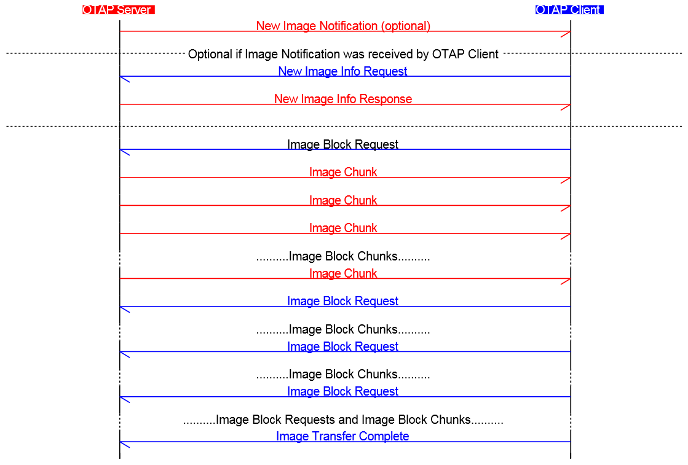

# OTAP client–server interactions

The interactions between the OTAP Server and OTAP Client start immediately after the connection, discovery of the OTAP Service characteristics and writing of the OTAP Control Point CCC Descriptor by the OTAP Server.

The first command sent could be a New Image Notification sent by the OTAP Server to the OTAP Client or a New Image Info Request sent by the OTAP Client. The OTAP Server can respond with a New Image Info response if it has a new image for the device which sent the request \(this can be determined from the *ImageVerison* parameter\). The best strategy depends on application requirements.

After the OTAP Client has determined that the OTAP Sever has a newer image it can start downloading the image. This is done by Sending Image Block Request commands to retrieve parts of the image file. The OATP Server answers to these requests with one or more Image Chunk Commands via the requested transfer method or with an Error Notification if there are improper parameters in the Image Block Request. The OTAP Client makes as many Image Block Requests as it is necessary to transfer the entire image file.

The OTAP Client decides how often Image Block Request Commands are sent and can even stop a block transfer which is in progress via the Stop Image Transfer Command. The OTAP Client is in complete control of the image download process and can stop it and restart it at any time based on its resources and application requirements.

A typical **Bluetooth LE OTAP Image Transfer** scenario is shown in the message sequence chart [Figure](../images/../images/figure17_OTAP_Image_Transfer.png).

**Parent topic:**[Bluetooth LE OTAP protocol](../topics/bluetooth_le_otap_protocol.md)

