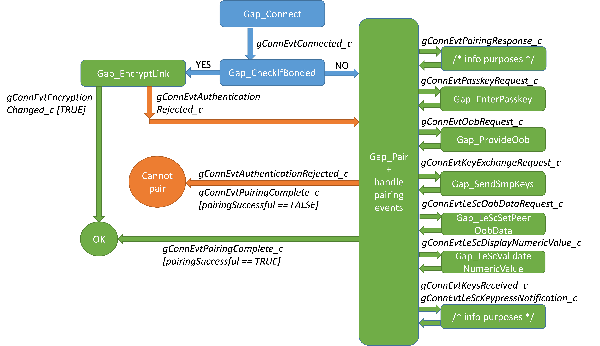

# Pairing and bonding \(Central\)

After the user has connected to a Peripheral, use the following function to check whether this device has bonded in the past:

``` 
bleResult_t Gap_CheckIfBonded
(
    deviceId_t   deviceId,
    bool_t *     pOutIsBonded
    uint8_t*    pOutNvmIndex
);
```

If it has, link encryption can be requested with:

```
bleResult_t Gap_EncryptLink
(
    deviceId_t     deviceId
);
```

If the link encryption is successful, the *gConnEvtEncryptionChanged\_c* connection event is triggered. Otherwise, a *gConnEvtAuthenticationRejected\_c*event is received with the *rejectReason* event data parameter set to *gLinkEncryptionFailed\_c*.

On the other hand, if this is a new device \(not bonded\), pairing may be started as shown here:

``` 
bleResult_t Gap_Pair
(
    deviceId_t                       deviceId,
    const gapPairingParameters_t *   pPairingParameters
);
```

The pairing parameters are shown here:

``` 
typedef struct gapPairingParameters_tag {
    bool_t                        withBonding ;
    gapSecurityModeAndLevel_t     securityModeAndLevel ;
    uint8_t                       maxEncryptionKeySize ;
    gapIoCapabilities_t           localIoCapabilities ;
    bool_t                        oobAvailable ;
    gapSmpKeyFlags_t              centralKeys ;
    gapSmpKeyFlags_t              peripheralKeys ;
    bool_t                        leSecureConnectionSupported ;
    bool_t                        useKeypressNotifications ;
} gapPairingParameters_t;
```

The names of the parameters are self-explanatory. The *withBonding* flag should be set to *TRUE* if the Central must/wants to bond.

When Advanced Secure Mode is enabled, \(*gAppSecureMode\_d* id defined as *1* in *app\_preinclude.h*\), the security mode and level for pairing is automatically enforced as Mode 1 Level 4, and LE Secure Connection Supported is automatically enforced TRUE. Legacy pairing is not supported in this mode.

For the Security Mode and Level, the GAP layer defines them as follows:

-   Security Mode 1 Level 1 stands for no security requirements.
-   Except for Level 1 \(which is only used with Mode 1\), Security Mode 1 requires encryption, while Security Mode 2 requires data signing.
-   Mode 1 Level 2 and Mode 2 Level 1 do not require authentication \(in other words, they allow Just Works pairing, which has no MITM protection\). Mode 1 Level 3 and Mode 2 Level 2 require authentication \(must pair with PIN or OOB data, which provide MITM protection\).
-   Starting with Bluetooth specification 4.2, OOB pairing offers MITM protection only in certain conditions. The application must inform the stack if the OOB data exchange capabilities offer MITM protection via a dedicated API.
-   Security Mode 1 Level 4 is reserved for authenticated pairing \(with MITM protection\) using a LE Secure Connections pairing method.
-   If a pairing method is used but it does not offer MITM protection, then the pairing parameters must use Security Mode 1 level 2. If the requested pairing parameters are incompatible \(for example, Security Mode 1 Level 4 without LE Secure Connections enabled\), a `gBleInvalidParameter_c` status is returned by the security API functions: `Gap_SetDefaultPairingParameters`, `Gap_SendPeripheralSecurityRequest`, `Gap_Pair` and `Gap_AcceptPairingRequest`.

|—|No security|No MITM protection|Legacy MITM protection|LE secure connections with MITM protection|
|--|-----------|------------------|----------------------|------------------------------------------|
|**Mode 1 \(encryption\)** distributed LTK \(EDIV+RAND\) or generated LTK|**Level 1** no security|**Level 2** unauthenticated encryption|**Level 3** authenticated encryption|**Level 4** LE SC authenticated encryption|
|**Mode 2 \(data signing\)** distributed CSRK|—|**Level 1** unauthenticated data signing|**Level 2** authenticated data signing|—|

The *centralKeys* should have the flags set for all the keys that are available in the application. The IRK is mandatory if the Central is using a Private Resolvable Address, while the CSRK is necessary if the Central wants to use data signing. The LTK is provided by the Peripheral and should only be included if the Central intends on becoming a Peripheral in future reconnections \(GAP role change\).

The *peripheralKeys* should follow the same guidelines. The LTK is mandatory if encryption is to be performed, while the peer’s IRK should be requested if the Peripheral is using Private Resolvable Addresses.

See table below for detailed guidelines regarding key distribution.

The first three rows are both guidelines for Pairing Parameters \(*centralKeys* and *peripheralKeys*\) and for distribution of keys with *Gap\_SendSmpKeys*.

If LE Secure Connections Pairing is performed \(Bluetooth Low Energy 4.2 and above\), then the LTK is generated internally, so the corresponding bits in the key distribution fields from the pairing parameters are ignored by the devices.

The Identity Address is distributed if the IRK is also distributed \(its flag has been set in the Pairing Parameters\). Therefore, it can be “asked” only by asking for IRK \(it does not have a separate flag in a *gapSmpKeyFlags\_t* structure\). Therefore, it is N/A.

The negotiation of the distributed keys is as follows:

-   In the SMP Pairing Request \(started by *Gap\_Pair*\), the Central sets the flags for the keys it wants to distribute \(*centralKeys*\) and receive \(*peripheralKeys*\).


|   | Central keys (Central) | Peripheral keys (Central) | Peripheral () keys | Central keys (peripheral) |
| - | ---------------------- | ------------------------- | ------------------ | ------------------------- |
| Long Term Key (LTK)<br>+EDIV +RAND | If it wants to be a peripheral in a future reconnection | If it wants encryption | If it wants encryption | If it wants to become a central in a future reconnection |
| Identity Resolving Key (IRK) | If it uses or intends to use private resolvable addresses | If a peripheral is using a private resolvable address | If it uses or intends to use private resolvable addresses | If a central is using a private resolvable address |
| Connection Signature Resolving Key (CSRK) | If it wants to sign data as GATT Client | If it wants the peripheral to sign data as GATT Client | If it wants to sign data as GATT Client | If it wants the Central to sign data as GATT Client |
| Identity address | If it distributes the IRK | N\/A | If it distributes the IRK | N\/A |

-   The Peripheral examines the two distributions and must send an SMP Pairing Response \(started by the *Gap\_AcceptPairingRequest*\) after performing any changes it deems necessary. The Peripheral is only allowed to set to 0 some flags that are set to 1 by the Central, but not the other way around. For example, it cannot request/distribute keys that were not offered/requested by the Central. If the Peripheral is adverse to the Central’s distributions, it can reject the pairing by using the *Gap\_RejectPairing* function.
-   The Central examines the updated distributions from the Pairing Response. If it is adverse to the changes made by the Peripheral, it can reject the pairing \(*Gap\_RejectPairing*\). Otherwise, the pairing continues and, during the key distribution phase \(the *gConnEvtKeyExchangeRequest\_c* event\) only the final negotiated keys are included in the key structure sent with *Gap\_SendSmpKeys*.
-   For LE Secure Connections \(both devices set the SC bit in the AuthReq field of the Pairing Request and Pairing Response packets\), the LTK is not distributed. It is generated and the corresponding bit in the Initiator Key Distribution and Responder Key Distribution fields of the Pairing Response packet are set to 0.

If LE Secure Connections Pairing \(Bluetooth LE 4.2 and above\) is used, and OOB data needs to be exchanged, the application must obtain the local LE SC OOB Data from the Bluetooth LE Host Stack by calling the *Gap\_LeScGetLocalOobData* function. The data is contained by the generic *gLeScLocalOobData\_c* event.

The local LE SC OOB Data is refreshed in the following situations:

-   The *Gap\_LeScRegeneratePublicKey* function is called \(the *gLeScPublicKeyRegenerated\_c* generic event is also generated as a result of this API\).
-   The device is reset \(which also causes the Public Key to be regenerated\).

If the pairing continues, the following connection events may occur:

-   **Request events**
    -   *gConnEvtPasskeyRequest\_c*: a PIN is required for pairing; the application must respond with the *Gap\_EnterPasskey\(deviceId, passkey\).*
    -   *gConnEvtOobRequest\_c*: if the pairing started with the *oobAvailable* set to *TRUE* by both sides; the application must respond with the *Gap\_ProvideOob\(deviceId, oob\).*
    -   *gConnEvtKeyExchangeRequest\_c*: the pairing has reached the key exchange phase; the application must respond with the *Gap\_SendSmpKeys\(deviceId, smpKeys\).*
    -   *gConnEvtLeScOobDataRequest\_c*: the stack requests the LE SC OOB Data received from the peer \(r, Cr and Addr\); the application must respond with *Gap\_LeScSetPeerOobData\(deviceId, leScOobData\).*
    -   *gConnEvtLeScDisplayNumericValue\_c*: the stack requests the display and confirmation of the LE SC Numeric Comparison Value; the application must respond with *Gap\_LeScValidateNumericValue\(deviceId, ncvValidated\).*
-   **Informational events**
    -   *gConnEvtKeysReceived\_c*: the key exchange phase is complete; keys are automatically saved in the internal device database and are also provided to the application for immediate inspection; application does not have to save the keys in NVM storage because this is done internally if *withBonding*was set to TRUE by both sides.
    -   *gConnEvtAuthenticationRejected\_c*: the peer device rejected the pairing; the *rejectReason* parameter of the event data indicates the reason that the Peripheral does not agree with the pairing parameters \(it cannot be *gLinkEncryptionFailed\_c* because that reason is reserved for the link encryption failure\).
    -   *gConnEvtPairingComplete\_c*: the pairing process is complete, either successfully, or an error may have occurred during the SMP packet exchanges; note that this is different from the *gConnEvtKeyExchangeRequest\_c* event; the latter signals that the pairing was rejected by the peer, while the former is used for failures due to the SMP packet exchanges.
    -   *gConnEvtLeScKeypressNotification\_c*: the stack informs the application that a remote SMP Keypress Notification has been received during Passkey Entry Pairing Method.

After the link encryption or pairing is completed successfully, the Central may immediately start exchanging data using the GATT APIs. Gap_RejectPairing may be called on any pairing event.

**Figure 4. Central pairing flow – APIs and events.**


**Parent topic:**[Central setup](../topics/central_setup_001.md)

