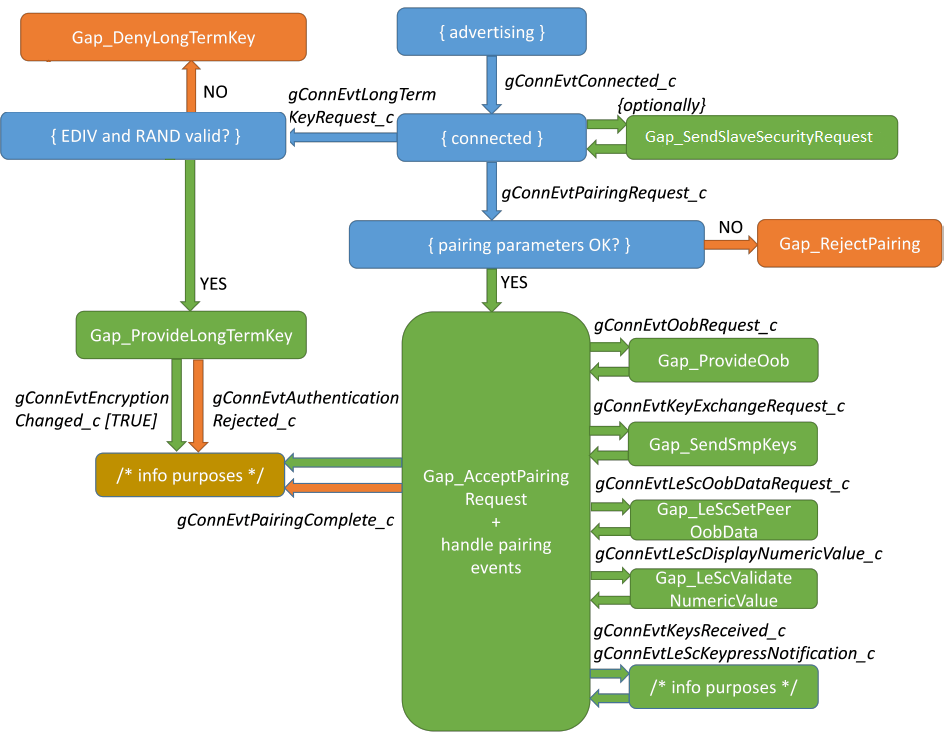

# Pairing and bonding \(peripheral\)

After a connection has been established to a Central, the Peripheral’s role regarding security is a passive one. It is the responsibility of the Central device to start the pairing process. In case, the devices have already bonded in the past, the Central encrypts the link using the shared LTK.

The Peripheral sends error responses \(at ATT level\) with proper error code if the Central attempts to access sensitive data without authenticating. Examples of such error responses are: Insufficient Authentication, Insufficient Encryption, Insufficient Authorization, and so on. Therefore, it indicates to the Central that it needs to perform security procedures.

All security checks are performed internally by the GAP module and the security error responses are sent automatically. All the application developer needs to do is register the security requirements.

First, when building the GATT Database \(see [Creating GATT database](creating_gatt_database.md#)\), the sensitive attributes should have the security built into their access permissions \(for example, read-only / read with authentication / write with authentication / write with authorization, and so on.\).

Second, if the GATT Database requires additional security besides that already specified in attribute permissions \(for example, certain services require higher security in certain situations\), the following function must be called:

```
bleResult_t Gap_RegisterDeviceSecurityRequirements
(
    const gapDeviceSecurityRequirements_t * pSecurity
);
```

The parameter is a pointer to a structure which contains a “device security setting” and service-specific security settings. All these security requirements are pointers to `gapSecurityRequirements_t` structures. The pointers that are to be ignored should be set to `NULL`.

Although the Peripheral does not initiate any kind of security procedure, it can inform the Central about its security requirements. This is usually done immediately after the connection to avoid exchanging useless packets for requests that might be denied because of insufficient security.

The informing is performed through the Peripheral Security Request packet at SMP level. To use it, the following GAP API is provided:

``` 
bleResult_t Gap_SendPeripheralSecurityRequest
(
    deviceId_t                    deviceId,
    const gapPairingParameters_t* pPairingParameters
);
```

The `gapPairingParameters_t` structure includes two important fields. The withBonding field indicates to the Central whether this Peripheral can bond and the securityModeAndLevel field informs about the required security mode and level that the Central should pair for. See [Pairing and bonding \(Central\)](pairing_and_bonding_central.md) for an explanation about security modes and levels, as defined by the GAP module.

This request expects no reply, nor any immediate action from the Central. The Central may easily choose to ignore the Peripheral Security Request.

If the two devices have bonded in the past, the Central proceeds directly to encrypting the link. If the bond was not made using LE Secure Connections, the Peripheral expects to receive a `gConnEvtLongTermKeyRequest_c` connection event. If the bond was made using LE Secure Connections, the Host provides the LTK automatically to the LE Controller.

When the devices have been previously pairing without using LE Secure Connections, along with the Peripheral’s LTK, the EDIV \(2 bytes\) and RAND \(8 bytes\) values were also sent \(their meaning is defined by the SMP\). Therefore, before providing the key to the Controller, the application should check that the two values match with those received in the `gConnEvtLongTermKeyRequest_c` event. If they do, the application should reply with:

``` 
bleResult_t Gap_ProvideLongTermKey
(
    deviceId_t         deviceId,
    const uint8_t      aLtk,
    uint8_t            ltkSize
);
```

The LTK size cannot exceed the maximum value of 16.

If the EDIV and RAND values do not match, or if the Peripheral does not recognize the bond, it can reject the encryption request with:

```
bleResult_t Gap_DenyLongTermKey
(
    deviceId_t deviceId
);
```

If LE SC Pairing was used then the LTK is generated internally by the Bluetooth LE Host Stack and it is not requested from the application during post-bonding link encryption. In this scenario, the application is only notified of the link encryption through the `gConnEvtEncryptionChanged_c` connection event.

If the devices are not bonded, the Peripheral should expect to receive the `gConnEvtPairingRequest_c`, indicating that the Central has initiated pairing.

If the application agrees with the pairing parameters \(see [Pairing and bonding \(Central\)](pairing_and_bonding_central.md#) for detailed explanations\), it can reply with:

```
bleResult_t Gap_AcceptPairingRequest
(
    deviceId_t                       deviceId,
    const gapPairingParameters_t *   pPairingParameters
);
```

This time, the Peripheral sends its own pairing parameters, as defined by the SMP.

After sending this response, the application should expect to receive the same pairing events as the Central \(see [Pairing and bonding \(Central\)](pairing_and_bonding_central.md#)\), with one exception: the `gConnEvtPasskeyRequest_c` event is not called if the application sets the Passkey \(PIN\) for pairing before the connection by calling the API:

```
bleResult_t Gap_SetLocalPasskey
(
    uint32_t passkey
);
```

This is done because, usually, the Peripheral has a static secret PIN that it distributes only to trusted devices. If, for any reason, the Peripheral must dynamically change the PIN, it can call the aforementioned function every time it wants to, before the pairing starts \(for example, right before sending the pairing response with `Gap_AcceptPairingRequest`\).

If the Peripheral application never calls `Gap_SetLocalPasskey`, then the `gConnEvtPasskeyRequest_c` event is sent to the application as usual.

The Peripheral can use the following API to reject the pairing process:

```
bleResult_t Gap_RejectPairing
(
deviceId_t                         deviceId,
gapAuthenticationRejectReason_t    reason
);
```

The `reason` should indicate why the application rejects the pairing. The value `gLinkEncryptionFailed_c` is reserved for the `gConnEvtAuthenticationRejected_c` connection event to indicate the link encryption failure rather than pairing failures. Therefore, it is not meant as a pairing reject reason.

The `Gap_RejectPairing` function may be called not only after the Pairing Request was received, but also during the pairing process. For example, when handling pairing events or asynchronously, if for any reason the Peripheral decides to abort the pairing, this function can be called. This also holds true for the Central. [Figure](../images/figure4-peripheralflow.png) illustrates the Peripheral pairing flow and lists the main APIs and events. `Gap_RejectPairing` can be called on any pairing event.



For both the Central and the Peripheral, bonding is performed internally and is not the application’s concern. The `gConnEvtPairingComplete_c` event parameters inform the application if bonding has occurred.

**Parent topic:**[Peripheral setup](../topics/peripheral_setup_002.md)

