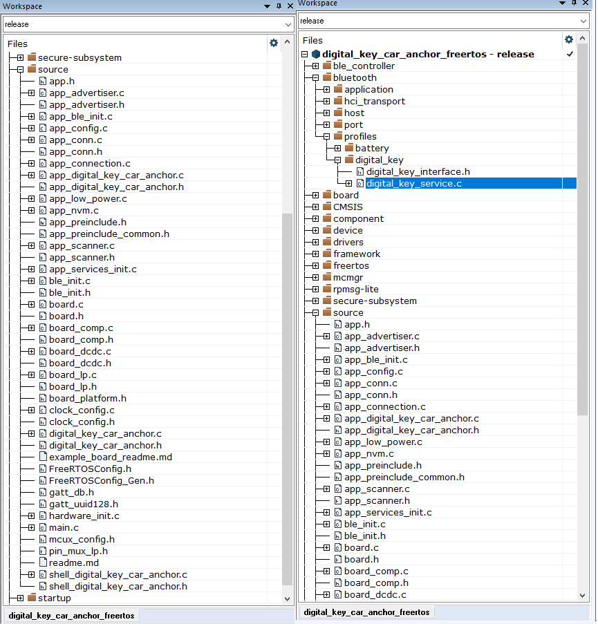

# Deploying CCC Digital Key applications software

The software package includes the components necessary for CCC Digital Key R3 application development on the selected NXP platform. These components include:

-   Bluetooth Low Energy Host and Controller software libraries \(KW38\)
-   NBU image binaries
-   Examples of demo application projects corresponding to CCC Digital Key roles \(Device and Car Anchor\)
-   Platform peripheral drivers, platform startup code, other generic platform software

**Note:**

Prior to loading any wireless SDK example, update your NBU image with the provided binaries in the following folder of the SDK:

`../middleware/wireless/ble_controller/bin`.

The demo applications were compiled and tested with **IAR Embedded Workbench** for Arm and **ARMGCC**. It is recommended to use one of these tools.

To open, build, and run any example application, see the *Bluetooth Low Energy Quick Start Guide* document of the corresponding board. The CCC Digital Key R3 examples are built and run in the same fashion as Bluetooth Low Energy examples.

The [Figure 1](../images/projectstructure_2025.png) shows the application folder structure for the *digital_key_car_anchor* project.

The relevant files for CCC Digital Key R3 are the following:

-   The main application source files `source/digital_key_car_anchor.c` and `source/app_digital_key_car_anchor.c`, and
-   The files in `bluetooth/profiles/digital_key`, which implement the Digital Key Service defined by the CCC Digital Key R3 specification.

**Application folder structure in workspace**

