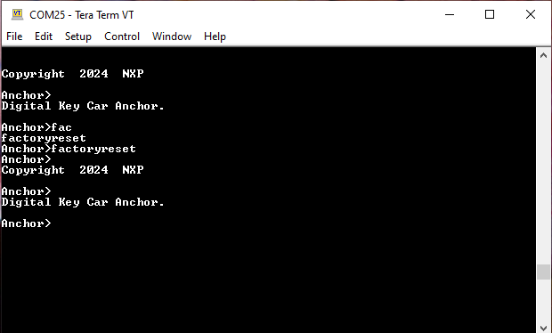
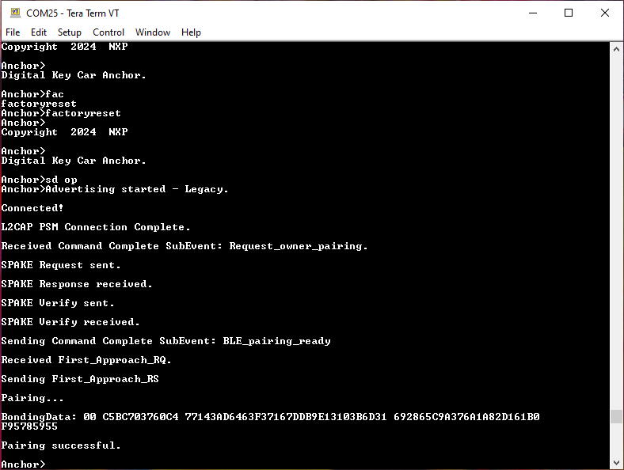
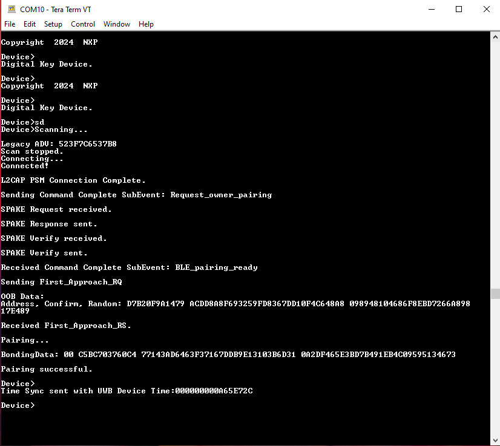

# Owner Pairing Scenario

Owner Pairing establishes a bond between the Digital Key Car Anchor and the Digital Key Device as per the CCC Digital Key R3 specification. The Car Anchor starts advertising using Legacy mode on the 1M PHY. The Device scans and connects. After establishing the connection, the Device performs service discovery. This step enables it to discover the DK Service and learn the PSM value it would use in order to open an L2CAP channel to the Car Anchor. This channel is used to exchange data and security information as part of the Bluetooth Low Energy Out-of-Band \(OOB\) pairing process. All security information exchanged consists of dummy messages. The applications do not currently implement any of the UWB and Secure Element functionality described by CCC Digital Key R3.

The first step is to run the "`factoryreset`" command on both boards in order to ensure no previous bonding data is present in non-volatile memory. See [Figure 1](../images/factory_reset.png).

**Factory reset on Car Anchor**

The next step is to run the "`sd`" command \(Start Discovery\) on the Device and the "`sd op`" command on the Car Anchor \(Owner Pairing advertising differs from Passive Entry, using a single Legacy advertising set on the 1M PHY\). The Car Anchor starts advertising while the Device scans. Since both boards have been factory reset, they follow the Owner Pairing flow. The output of the commands is shown in [Figure 2](../images/op_anc.png).

**Owner Pairing on Car Anchor**

[Figure 3](../images/op_dev.png) shows the owner pairing on the Device.

**Owner Pairing on Device**

**Parent topic:**[Running CCC Digital Key scenarios using the Shell Interface](../topics/running_ccc_digital_key_scenarios_using_the_shell_.md)
