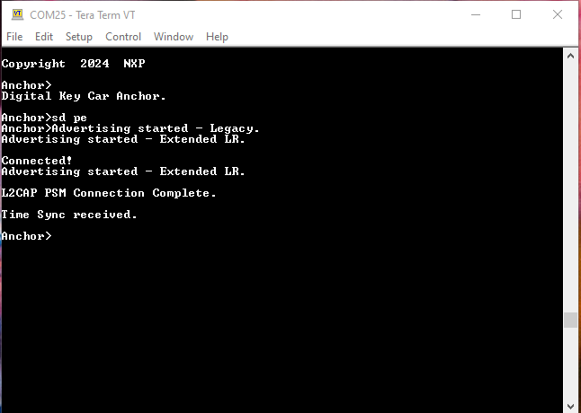
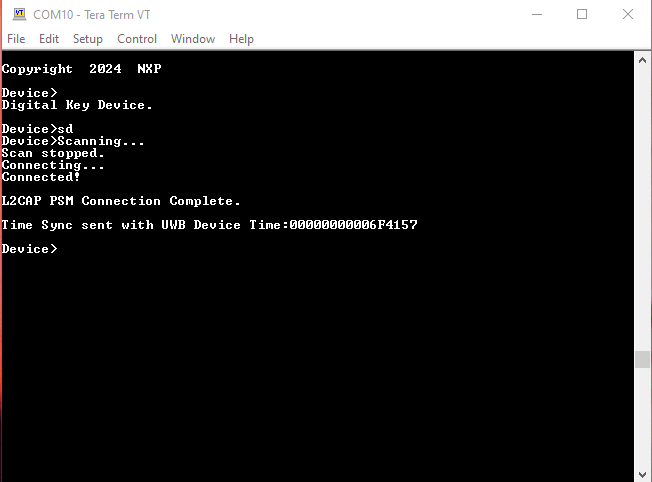

# Passive Entry Scenario

The Passive Entry scenario runs after Owner Pairing between a Car Anchor and a Device completes successfully.

To run the Passive Entry demo, first, reset the recently paired boards using either the **RST** switch or the "`reset`" command in the shell. Do NOT perform a factory reset, as this removes the bonding information from non-volatile memory.

After reset, run the "`sd pe`" command on the Car Anchor and "`sd`" command on the Device as shown in [Figure 1](../images/pe_anc.png) and [Figure 2](../images/pe_dev.png). For the Passive Entry scenario, the Car Anchor advertises using two sets, one Legacy on the 1M PHY and one Extended on the Coded PHY. If bonding data is present, it follows the Passive Entry flow and stops after the successful creation of the L2CAP channel. At this point the application is functional. The output of the command is shown in [Figure 1](../images/pe_anc.png) and [Figure 2](../images/pe_dev.png). Similar to the Owner Pairing scenario, the applications implement only the Bluetooth Low Energy functionality.

**Note:** The CCC specification requires using coding scheme S=2 for Coded PHY advertising, equivalent to a data rate of 500 Kbits per sec. To experiment with other coding schemes, change the value of the *`mLongRangeAdvCodingScheme_c`* macro in the *`app_preinclude.h`* file for the `digital_key_car_anchor` project.

**Passive Entry on Car Anchor**

**Passive Entry on Device**

**Parent topic:**[Running CCC Digital Key scenarios using the Shell Interface](../topics/running_ccc_digital_key_scenarios_using_the_shell_.md)

