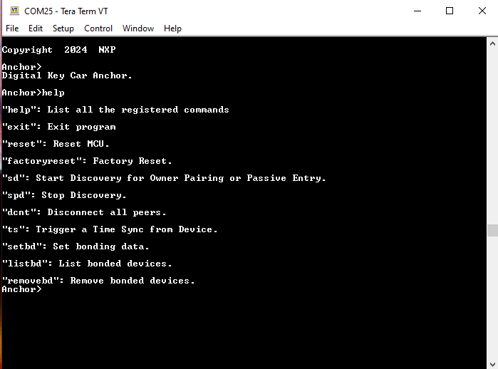

# Running CCC Digital Key scenarios using the Shell Interface

The following CCC Digital Key R3 examples are provisioned by default with a shell command line interface accessible via a Terminal application such as Tera Term:

-   Digital Key Car Anchor
-   Digital Key Device

After connecting through the Terminal application and pressing the RST switch on the board, a welcome message appears. Entering the command "`help`" displays the list of available commands and their descriptions. See [Figure 1](../images/ccc_anc_cmd_list.png).

**List of commands**




```{include} ../topics/owner_pairing_scenario.md
:heading-offset: 1
```

```{include} ../topics/passive_entry_scenario.md
:heading-offset: 1
```

```{include} ../topics/synchronizing_bonding_data_between_car_anchors.md
:heading-offset: 1
```

```{include} ../topics/connection_with_a_non-ccc_key_fob_scenario.md
:heading-offset: 1
```

