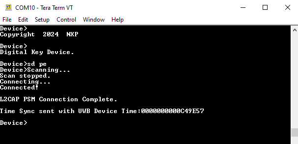
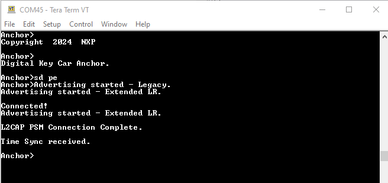

# Running the Passive Entry with DBAF scenario

The Passive Entry with DBAF scenario runs after Owner Pairing between a Car Anchor and a Device successfully completes.

1.  To run the Passive Entry with DBAF demo, reset the recently paired boards using either the **RST** switch or the "`reset`" command in the shell. Do NOT perform a factory reset, as this removes the bonding information from non-volatile memory.
2.  After reset, run the "`sd pe`" command on the Car Anchor and "`sd pe`" command on the Device as shown in [Figure 1](../images/dev_dbaf.png) and [Figure 2](../images/anc_dbaf.png).

**Passive Entry with DBAF on Device**

**Passive Entry with DBAF on Car Anchor**

After following these steps, the Passive Entry scenario as described in [Passive Entry Scenario](passive_entry_scenario.md) runs.

**Parent topic:**[Running Passive Entry Scenario with Decision Based Advertising Filtering \(DBAF\)](../topics/running_passive_entry_scenario_with_decision_based.md)

